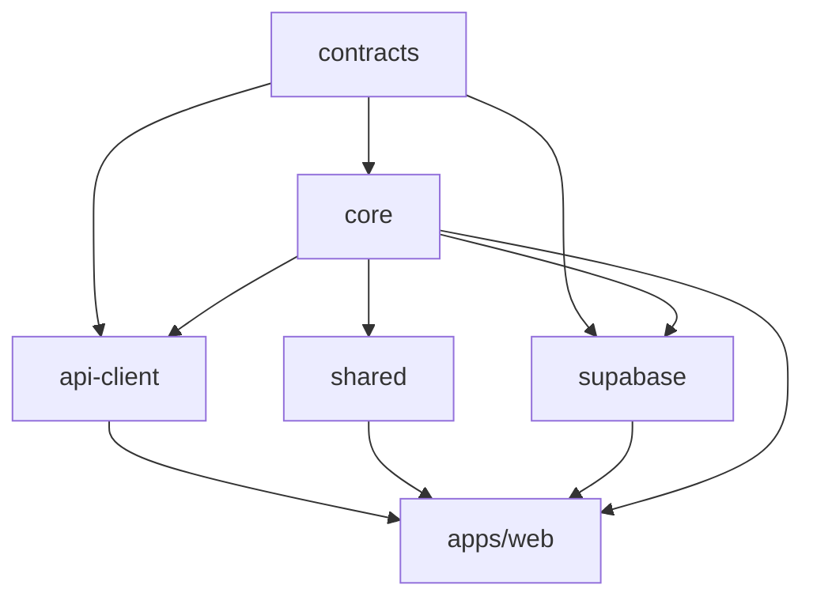
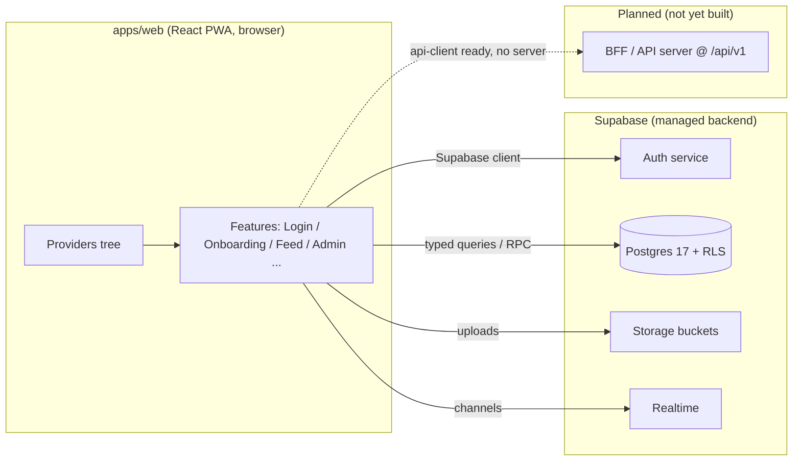

# 01 — Project Overview

> **SUPERCAMPUS (supernew)** — Greenfield campus platform.

This document gives a high-level overview of the repository. It is the entry point for
onboarding. For deep details see the other documents in this `docs/` folder, especially
[`15_AI_CONTEXT.md`](./15_AI_CONTEXT.md) and [`02_ARCHITECTURE.md`](./02_ARCHITECTURE.md).

---

## 1. What This Project Is

SUPERCAMPUS is a **campus community platform** (a "super app" for a university campus)
being rebuilt from the ground up. It is intended to eventually cover social feed,
messaging, a marketplace, projects & crowdfunding, events, jobs, hostel management,
food delivery, notifications, a campus directory, and admin tools.

The repository at hand (`supernewcopy`) is a **greenfield / monorepo rebuild** that
replaces an earlier legacy application (referred to as `superold`). Only the *foundation*
and a small slice of features are implemented; most product features are still
placeholders.

> **Important:** The README describes "Phase 3 — Platform foundation only," but the
> current code goes further: authentication, role-based authorization, profile
> bootstrap, onboarding, role requests, admin approval, and a working **Feed** are
> actually implemented. The rest of the product routes are placeholders.

---

## 2. Purpose

- Provide a **typed, migration-first, monorepo** foundation for the campus platform.
- Separate **contracts** (shared types), **core** (framework-agnostic infrastructure),
  **shared UI**, a typed **Supabase** client/facades, and the **web** PWA.
- Enforce **RBAC + feature gating** through the database (RLS + role/permission tables).
- Make the codebase safe for AI-assisted development by centralizing conventions in
  [`13_DEVELOPER_GUIDE.md`](./13_DEVELOPER_GUIDE.md) and [`16_CLAUDE.md`](./16_CLAUDE.md).

---

## 3. Main Features (Current State)

| Feature | Status | Notes |
|---------|--------|-------|
| **Auth** (signup, sign-in, password reset, session) | ✅ Implemented | Via Supabase Auth (`@supercampus/supabase`) |
| **Profile bootstrap** | ✅ Implemented | Auto-created by DB trigger + client bootstrap |
| **Authorization (roles/features/permissions)** | ✅ Implemented | RBAC service + provider |
| **Onboarding wizard** | ✅ Implemented | Multi-step, submits a role request |
| **Role requests + admin approval** | ✅ Implemented | `role_requests` table + admin pages |

---

## 4. Target Users

- **Students**, **faculty**, **alumni**, **hostel staff**, **vendors**, and **moderators**
  on a university campus.
- **Admins** (`super_admin`, `campus_admin`) who approve role requests and manage content.
- **Developers / AI assistants** who build on the platform foundation.

---

## 5. Current Implementation Status

- **Phase 3 / 3B (foundational shell):** mostly complete — packages, providers, routing,
  theme, auth, RBAC, storage façade, realtime façade.
- **Auth + Onboarding + Role Requests (Phase 3B+):** implemented and functional.
- **Feed:** implemented (posts, comments, likes, pagination) against the `posts` schema.
- **Everything else:** routes registered but rendered as `PlaceholderPage`.
- **No backend server** exists yet. The only "backend" is Supabase (Postgres + RLS + Auth
  + Storage + Realtime).

---

## 6. Tech Stack

| Layer | Technology |
|-------|-----------|
| **Language** | TypeScript 5.8 (`strict`) — all application code |
| **Monorepo** | pnpm workspaces (`pnpm@9.15.0`), `pnpm-workspace.yaml` |
| **Frontend** | React 19, Vite 6, React Router 7, @tanstack/react-query |
| **Styling** | Plain CSS with design tokens (`tokens.css`), `sc-` prefixed classes |
| **Auth / Backend / DB / Storage / Realtime** | Supabase (Postgres 17, RLS, Auth, Storage, Realtime) |
| **Validation** | Zod |
| **State** | React Context + hooks; per-feature provider pattern |
| **Code quality** | ESLint 9 (flat config) + Prettier |
| **Node engines** | `>=20` |

---

## 7. Folder Structure (top level)

```text
supernewcopy/
├── apps/
│   └── web/                 # PWA client (Vite + React)
├── packages/
│   ├── contracts/           # Shared DTOs, errors, events, permissions
│   ├── core/                # Framework-agnostic infra (auth port, config, events, routes)
│   ├── shared/              # Design system, theme, UI primitives
│   ├── api-client/          # Typed HTTP client (BFF not yet built)
│   └── supabase/            # Typed Supabase client, providers, service façades
├── supabase/
│   ├── migrations/          # 24 SQL migrations (schema + RLS + storage + fixes)
│   ├── seed/                # Idempotent seed data
│   └── config.toml          # Local Supabase config
├── tooling/
│   └── tsconfig/            # Shared TS base/react/node configs
├── src/                     # ⚠️ LEGACY (superold partial migration) — not used by app
├── docs/                    # This documentation
├── package.json             # Root scripts
├── pnpm-workspace.yaml
└── eslint.config.js
```

> **Legacy folder warning:** `src/` at the repository root contains old JavaScript
> (`src/core/event-bus.js`, `src/features/widgets/*`, `src/shared/dom/*`). This is a
> partial migration from `superold` and is **not** imported by the current app. See
> [`14_TODO.md`](./14_TODO.md) and [`16_CLAUDE.md`](./16_CLAUDE.md).

---

## 8. Monorepo Layout

`pnpm-workspace.yaml` globs `apps/*`, `packages/*`, `services/*`, and `tooling/*`.

- **`apps/web`** — the single consumer application.
- **`packages/*`** — library packages (all marked `private: true`, `workspace:*` deps).
- **`services/*`** — declared in the workspace glob but **no folder exists yet** (future BFF).
- **`tooling/*`** — shared TypeScript configs.

Package dependency graph (build order via `references` and `pnpm --filter`):



---

## 9. Overall Architecture



**Key idea:** The client talks **directly to Supabase** using a typed client and service
façades. Security is enforced **in the database** via Row Level Security (RLS) policies and
RBAC functions. There is **no application server yet**.

---

## 10. Cross-references

- Architecture: [`02_ARCHITECTURE.md`](./02_ARCHITECTURE.md)
- Database: [`03_DATABASE.md`](./03_DATABASE.md)
- APIs: [`04_API.md`](./04_API.md)
- Frontend: [`05_FRONTEND.md`](./05_FRONTEND.md)
- Backend: [`06_BACKEND.md`](./06_BACKEND.md)
- Authentication: [`07_AUTHENTICATION.md`](./07_AUTHENTICATION.md)
- Features: [`08_FEATURES.md`](./08_FEATURES.md)
- Routes: [`10_ROUTES.md`](./10_ROUTES.md)
- State management: [`11_STATE_MANAGEMENT.md`](./11_STATE_MANAGEMENT.md)
- Dev guide: [`13_DEVELOPER_GUIDE.md`](./13_DEVELOPER_GUIDE.md)

| **Feed** (posts, likes, comments, pagination) | ✅ Mostly complete | `FeedProvider` + `feed.ts` service |
| **Marketplace, Projects, Jobs, Events, Hostel, Food, Chat, Directory, Notifications, Analytics** | 🚧 Placeholder | Routes exist; DB schema exists; no UI |
| **Dashboard** | 🔶 Prototype | Partially wired, mostly "coming soon" cards |
| **BFF / API server** | ❌ Not implemented | `api-client` exists; no server exists |
