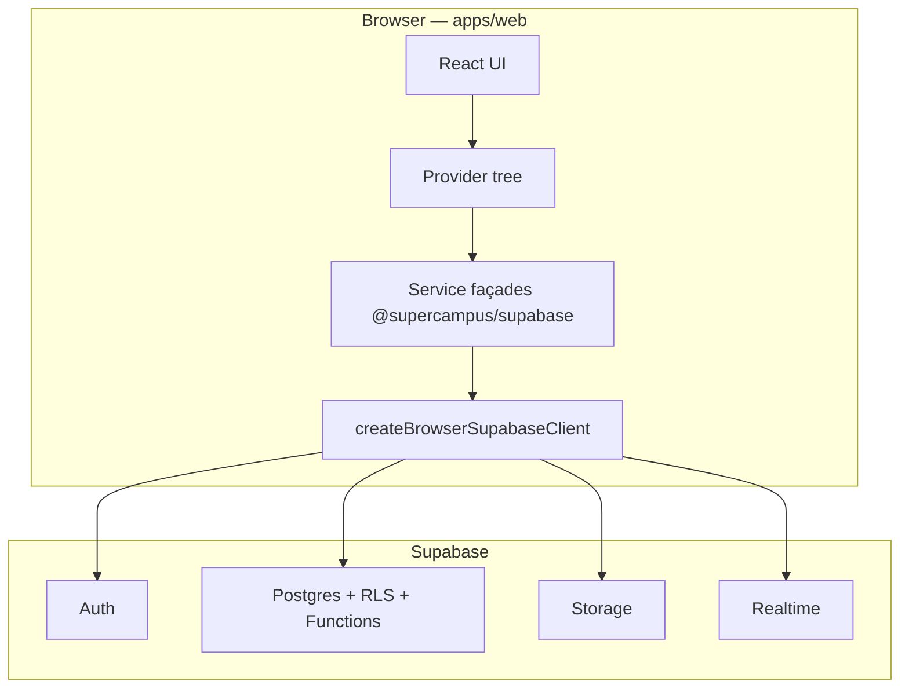
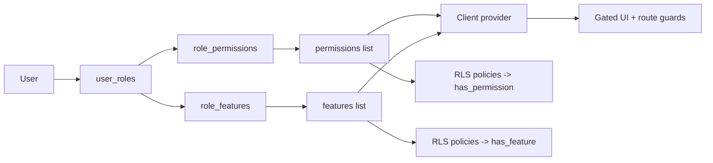
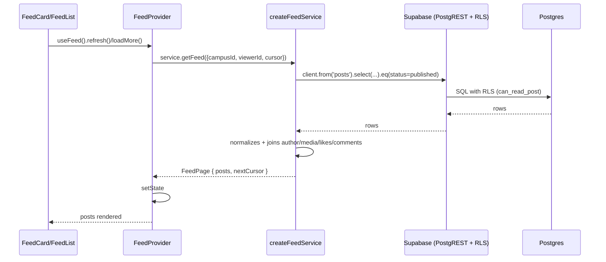
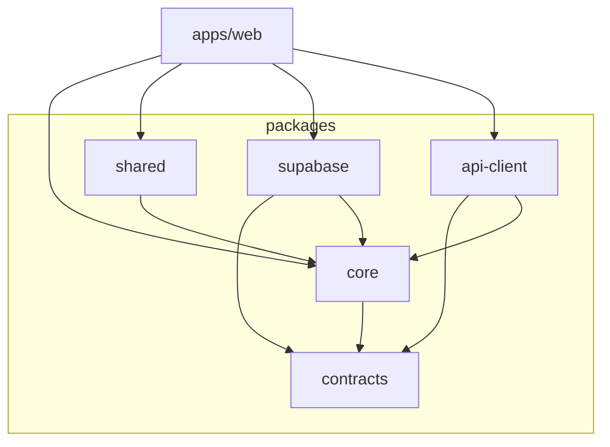
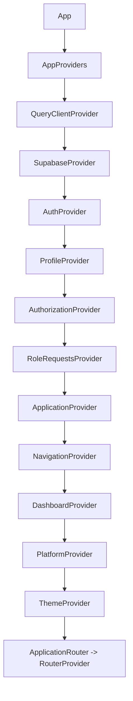

# 02 — Architecture

> Deep architecture documentation for SUPERCAMPUS (supernew).

This document describes how the system is actually built, from the high-level split down
to provider hierarchy and data/request flow. **Only what exists is documented.**

---

## 1. High-Level Architecture

The system has **no self-hosted backend**. It is a single-page React application
(`apps/web`) backed entirely by **Supabase**:

- **Postgres 17** database with schema, RLS, triggers, and functions (migration-first).
- **Auth** (Supabase Auth — email/password).
- **Storage** (private buckets).
- **Realtime** (channel publication for notifications/conversations).



**"Backend"** in this codebase therefore means **Supabase** plus the **`@supercampus/supabase`
service façade layer**, not an HTTP server. A BFF is planned (`services/`) but **does not
exist yet**. The `@supercampus/api-client` package is present and ready but unused at
runtime.

---

## 2. Frontend Architecture

- **Framework:** React 19 (function components + hooks), TypeScript strict.
- **Build:** Vite 6 (`apps/web/vite.config.ts`), alias `@` → `apps/web/src`, env prefix
  `VITE_` + `NEXT_PUBLIC_` for Supabase compatibility.
- **Routing:** React Router 7 (`createBrowserRouter`), route guards in
  `apps/web/src/app/routes/guards.tsx`.
- **Data fetching:** `@tanstack/react-query` (a `QueryClient` wraps everything).
- **Styling:** global CSS (`apps/web/src/styles/global.css`) importing design tokens from
  `@supercampus/shared/theme/tokens.css`. BEM-like `sc-` prefixed classes.

### Folder layout (frontend)

```text
apps/web/src/
├── main.tsx              # Entry — renders <App/>
├── app/
│   ├── App.tsx           # AppProviders + ApplicationRouter
│   ├── providers/        # AppProviders, ApplicationProvider, PlatformContext, useUserApplicationState
│   ├── routes/           # index.tsx (createBrowserRouter), guards.tsx
│   ├── layout/           # AppLayout (Header/Sidebar), MainLayout (legacy)
│   ├── navigation/       # NavigationProvider, navigationBuilder
│   ├── dashboard/        # DashboardProvider, DashboardPage, dashboardBuilder
│   ├── pages/            # Login, Onboarding, PendingApproval, Admin*, Placeholder, NotFound, ApplicationState
│   └── feed/             # FeedProvider, FeedContext, FeedPage, FeedCard, CommentThread, ...
└── styles/global.css
```

---

## 4. Database

- Postgres 17. Extensions: `pgcrypto`, `citext`, `pg_trgm`, `btree_gist`.
- **Migration-first workflow** (see `supabase/README.md`): changes are made only through
  `supabase migration new` + `supabase db push`; never through the dashboard.
- Client types are generated from the DB (`packages/supabase/src/database.types.ts`) and
  consumed everywhere as `Database`, `Tables<'name'>`, etc.

See [`03_DATABASE.md`](./03_DATABASE.md) for the full table catalog, ER diagram, and RLS map.

---

## 5. Supabase

Handled by the **`@supercampus/supabase`** package. It exposes:

- `createBrowserSupabaseClient(env)` / `createSupabaseClient(env)` — typed clients.
- `SupabaseProvider` / `useSupabase()` — React context providing the client.
- Service façades: `createAuthService`, `createProfileService`,
  `createAuthorizationService`, `createFeedService`, `createRoleRequestService`,
  `createStorage`, `createRealtime`, `createDatabase`.
- React providers: `AuthProvider`, `ProfileProvider`, `AuthorizationProvider`,
  `RoleRequestsProvider`.
- Server-only helpers: `loadServerSupabaseEnv`, `createServerSupabaseClient` (exported
  via `@supercampus/supabase/server`; **not** for browser use).

---

## 6. Authentication

- Uses **Supabase Auth** (email/password).
- `AuthProvider` listens to `onAuthStateChange`, holds `session`/`user` in context.
- Client options: `autoRefreshToken: true`, `detectSessionInUrl: true`, `persistSession: true`.

See [`07_AUTHENTICATION.md`](./07_AUTHENTICATION.md) for the full flow.

---

## 7. Authorization

Two layers:

1. **Client-side** — `AuthorizationProvider` loads `user_roles` → `role_permissions` →
   `role_features` into a snapshot (`roles`, `permissions`, `features`). Exposes helpers:
   `hasRole`, `hasPermission`, `hasAnyPermission`, `hasAllPermissions`, `hasFeature`.
2. **Database-side** — RLS policies call `has_permission(...)` / `has_feature(...)`.
   **The DB is the source of truth; client checks are for UX only.**



---

## 8. Storage

- Buckets are created in migration 6 (all **private**). Object paths are namespaced by
  `auth.uid()` (first folder segment) for owner-only policies.
- `storage.ts` exposes an unmodified `client.storage` façade; buckets are **only** created
  through migrations. There is **no upload UI yet** in the web app.

---

## 9. State Management

- **Global/platform context:** `PlatformContext` (`env`, `eventBus`, `apiClient`,
  `supabase`).
- **Auth/Profile/Authorization/RoleRequests:** dedicated providers from
  `@supercampus/supabase`.
- **Application-level:** `ApplicationProvider` aggregates load/error from the above.
- **Feature-level:** `FeedProvider` owns feed state (local `useState` + memoized callbacks);
  `DashboardProvider` + `NavigationProvider` derive from `AuthorizationProvider`.
- **Server cache:** `QueryClient` (staleTime 30s, retry 1, no refetch on window focus).
- **Event bus:** `createPlatformEventBus()` (typed, from `@supercampus/core`).

---

## 12. Data Flow

### Generic query flow (Feed example)



### Mutation flow (like / post / comment)

All feed mutations go through `FeedProvider` methods → `createFeedService` → Supabase
`.insert/.update/.upsert` → RLS validates ownership/permission.
**Optimistic updates** are applied in `FeedProvider` (see [`11_STATE_MANAGEMENT.md`](./11_STATE_MANAGEMENT.md)).

---

## 13. Request Flow & Response Flow

1. Request originates in a React component via a **provider hook** (e.g. `useAuth`,
   `useProfile`, `useFeed`).
2. The provider calls a **service façade** (`@supercampus/supabase`).
3. The service calls the typed **Supabase client** (REST/PostgREST, Realtime, Auth, Storage).
4. Supabase applies **JWT auth** and **RLS** before returning rows.
5. The service **normalizes** rows into domain types (e.g. `FeedPost`) and returns
   `{ data, error }` result objects.
6. The provider writes the result into context/state; components re-render.
7. Errors propagate as **user-facing strings** (each service maps Supabase errors to a
   friendly message).

Example result contract everywhere: `{ data: T | null; error: string | null }`.

---

## 14. Dependency Graph (source)



(Build order: `contracts` → `core` → (`shared`, `api-client`, `supabase`) → `apps/web`.)

---

## 15. Lifecycle

1. `main.tsx` mounts `<App/>`.
2. `App` renders `AppProviders`, which constructs **platform** (env, supabase, eventBus,
   apiClient) in `useMemo`.
3. Providers hydrate: Auth restores session → Profile boots profile → Authorization loads
   roles/permissions/features → RoleRequests loads the user's requests.
4. `ApplicationProvider` exposes `loading` / `error`; `App` shows a loading/error screen
   until ready, then renders the router.
5. `ApplicationRouter` uses `useUserApplicationState` to decide: login, onboarding,
   pending-approval, or the protected app.
6. Login redirects to `/home` (Feed); onboarding submits a role request → `/pending-approval`;
   on approval (server RLS + polling every 15s) the user is routed to `/home`.
7. **Logout** clears the Supabase session; providers reset via `authenticated === false`.

---

## 16. Cross-references

- Database: [`03_DATABASE.md`](./03_DATABASE.md)
- APIs: [`04_API.md`](./04_API.md)
- Frontend: [`05_FRONTEND.md`](./05_FRONTEND.md)
- Auth: [`07_AUTHENTICATION.md`](./07_AUTHENTICATION.md)
- State: [`11_STATE_MANAGEMENT.md`](./11_STATE_MANAGEMENT.md)


See [`11_STATE_MANAGEMENT.md`](./11_STATE_MANAGEMENT.md) for the full provider/context map.

---

## 10. Routing

- Single `createBrowserRouter` in `apps/web/src/app/routes/index.tsx`.
- `ROUTES` constants in `packages/core/src/routing/routes.ts`.
- Guards: `ProtectedLayout`, `PublicRoute`, `FeatureRoute`/`PermissionRoute`, `RootRedirect`.

```mermaid
graph TD
    ROOT[/] --> RR[RootRedirect -> routeForStatus]
    LOGIN[/login, /signup, /reset-password] --> P[PublicRoute]
    ON[/onboarding] --> ONP[OnboardingPage]
    PA[/pending-approval] --> PAP[PendingApprovalPage]
    PROTECTED[ProtectedLayout] --> HOME[/home -> FeedPage]
    PROTECTED --> PH[...placeholders]
    PROTECTED --> ADMIN[/admin/requests]
    ANY[/*] --> 404[NotFoundPage]
```

See [`10_ROUTES.md`](./10_ROUTES.md) for the full route table.

---

## 11. Providers & Context Hierarchy



Order **matters**: e.g. `AuthorizationProvider` depends on `ProfileProvider`; navigation and
dashboard depend on authorization features.


---

## 3. Backend Architecture (Supabase)

The only real backend is the **Supabase database**. Its structure is defined entirely by
SQL migrations in `supabase/migrations/` (0001–0024).

- **Tables:** ~70 tables across all future feature domains (see [`03_DATABASE.md`](./03_DATABASE.md)).
- **RLS:** Every domain table enables RLS. Policies reference helper functions
  (`has_permission`, `has_feature`, `can_read_post`, `current_campus_id`).
- **RBAC:** `roles`, `permissions`, `role_permissions`, `user_roles`, `feature_registry`,
  `role_features`.
- **Role requests:** `role_requests` (Phase 3B+).
- **Storage buckets:** created in migration `0006_media_and_storage.sql` (all private).

### Key DB functions

| Function | Purpose |
|----------|---------|
| `set_updated_at()` | Trigger that stamps `updated_at` on update |
| `current_profile_id()` | Returns `auth.uid()` (security definer, avoids RLS recursion) |
| `current_campus_id()` | Returns the caller's `profiles.campus_id` |
| `is_valid_object_path(text)` | Validates storage object paths |
| `has_permission(key, campus?)` | RBAC check used by RLS policies |
| `has_feature(key, campus?)` | Feature-gating check used by RLS policies |
| `can_read_post(row)` | Visibility helper for the feed |
| `create_profile_for_user()` | `after insert on auth.users` — auto-creates `profiles` + `user_settings` |
