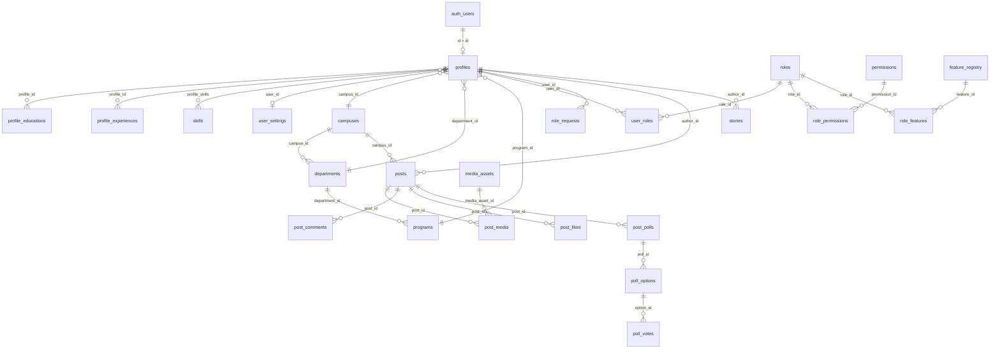

# 03 — Database

> Complete catalog of the SUPERCAMPUS database (Supabase / Postgres 17).

The schema is **migration-first**. It lives entirely in `supabase/migrations/` (0001–0024).
All tables, RLS policies, functions, triggers, storage buckets, and seed data are defined
there. The typed client contract is generated into `packages/supabase/src/database.types.ts`
and is the source of `Tables<'name'>` types used across `packages/supabase`.

---

## 1. Conventions

- **IDs:** `uuid primary key default gen_random_uuid()` for most tables; join tables use
  composite PKs.
- **Timestamps:** `timestamptz not null default timezone('utc', now())` and `updated_at`
  maintained by the `set_updated_at()` trigger.
- **Case-insensitive text:** `citext` is used for `code`, `handle`, `key`, `slug`, `name`.
- **Soft delete:** many content tables have `deleted_at timestamptz`. RLS + read helpers
  filter on it.
- **RLS is enabled on every domain table.** Read/write is gated by policies that call
  `auth.uid()`, `has_permission(...)`, `has_feature(...)`, and visibility helpers.

Extensions (migration 0001): `pgcrypto`, `citext`, `pg_trgm`, `btree_gist`.

---

## 2. ER Diagram (core + implemented domains)

The remaining domain tables (marketplace, projects, events, jobs, hostel, food, chat,
notifications, analytics, moderation) form similar clusters; see the per-domain groups
below and the full table catalog in `database.types.ts`.

---

## 3. Utility Functions & Triggers (migrations 0002, 0019, 0020)

| Object | Type | Purpose |
|--------|------|---------|
| `set_updated_at()` | trigger function | Sets `new.updated_at = now()` on `before update` |
| `current_profile_id()` | function | `select auth.uid()` (security definer) |
| `current_campus_id()` | function | Returns caller's `profiles.campus_id` (security definer) |
| `is_valid_object_path(text)` | function | Regex-validates storage object paths |
| `create_profile_for_user()` | trigger | `after insert on auth.users` → creates `profiles` + `user_settings` |
| `has_permission(text, uuid)` | function (security definer) | RBAC check via `user_roles`→`role_permissions`→`permissions` |
| `has_feature(text, uuid)` | function (security definer) | Feature check via `user_roles`→`role_features`→`feature_registry` |
| `can_read_post(p posts)` | function (security definer) | Feed visibility helper used by post-child policies |

`has_permission`/`has_feature` are **revoked from `public` and granted to `authenticated`**
(migration 0017). `current_profile_id`/`current_campus_id` are granted to `authenticated`

---

## 5. Profiles & Settings (migration 0004, fixes 0019/0020)

### `profiles`
- **Purpose:** the user profile (1:1 with `auth.users`).
- **Columns:** `id uuid PK FK→auth.users(id)` (on delete cascade), `campus_id
  FK→campuses`, `department_id FK→departments (set null)`, `program_id FK→programs (set
  null)`, `handle citext UNIQUE`, `display_name`, `given_name`, `family_name`,
  `bio`, `graduation_year smallint`, `avatar_asset_id uuid` (FK→media_assets added in
  migration 6), `directory_visibility` (private/campus/public), `is_active`, `created_at`,
  `updated_at`, `deleted_at`.
- **Constraints:** handle format, visibility enum, graduation_year 1950–2200.
- **RLS:**
  - `profiles_read` — own row, or `directory_visibility='public'`, or campus-visible to
    same-campus users (via `current_profile_id`/`current_campus_id`).
  - `profiles_update_own` — update own row only.
- **Trigger:** `create_profile_for_user()` on `insert into auth.users`.
- **Usage:** `packages/supabase/src/profile.ts` (`bootstrap`, `refresh`, `update`);
  `ProfileProvider`.

### `profile_educations`, `profile_experiences`, `skills`, `profile_skills`, `user_settings`
- **profile_educations:** `id PK`, `profile_id FK`, `institution`, `program`, `started_on`,
  `ended_on`. RLS: owner all.
- **profile_experiences:** `id PK`, `profile_id FK`, `employer`, `title`, `started_on`,
  `ended_on`, `is_current`, `visibility` (private/campus/public). RLS: read own or
  `visibility='public'`; owner all.
- **skills:** `id PK`, `name citext UNIQUE`, `category`. RLS: read all (authenticated).
- **profile_skills:** composite PK `(profile_id, skill_id)`, `proficiency` (1–5). RLS:
  read own or non-private profile; owner all.
- **user_settings:** PK `user_id FK→profiles`, `theme` (system/light/dark), `locale`,
  `email_notifications`, `push_notifications`, `preferences jsonb`. RLS: owner all.
  **Auto-created** alongside the profile by the auth trigger.

> **Note:** education/experience/skills/settings are **schema-only**; no web UI or service
> façade consumes them yet.

---

## 6. RBAC (migration 0005)

### `roles`
- **Columns:** `id PK`, `key citext UNIQUE`, `name`, `description`, `is_system`, timestamps.
- **RLS:** `roles_read` (select all authenticated); `roles_admin` (all where
  `has_permission('rbac.manage')`).
- **Seed:** `roles.sql` → `super_admin`, `campus_admin`, `faculty`, `student`, `alumni`,
  `vendor`, `hostel_staff`, `moderator`.

### `permissions`
- **Columns:** `id PK`, `key citext UNIQUE`, `module`, `description`, timestamps.
- **RLS:** `permissions_read` (select all); `permissions_admin` (all where `rbac.manage`).
- **Seed:** `permissions.sql` — `users.read`, `users.write`, `rbac.manage`,
  `features.manage`, `settings.manage`, `posts.create/edit/delete/moderate`,
  `stories.create/moderate`, `marketplace.create/purchase/moderate/categories.manage`,
  `projects.manage`, `crowdfunding.manage`, `events.manage`, `jobs.post/apply/manage`,
  `hostel.manage/allocate/outpasses.manage/complaints.manage/attendance.manage`,
  `food.manage`, `notifications.manage`, `analytics.read`, `audit.read`,
  `moderation.manage`, `media.manage`, `payments.read`.

### `role_permissions`
- **Purpose:** grant permissions to roles.
- **Columns:** composite PK `(role_id, permission_id)`, both FKs; timestamps.
- **RLS:** read all authenticated; admin all where `rbac.manage`.
- **Seed:** `role_permissions.sql` — `super_admin` gets **all**; other roles get
  least-privilege defaults (e.g. `student` → `posts.create, posts.edit,
  marketplace.create, marketplace.purchase, jobs.apply`).

### `user_roles`
- **Purpose:** role assignments per user/campus (with optional expiry).
- **Columns:** `id PK`, `user_id FK→profiles`, `role_id FK→roles`, `campus_id FK→campuses`,
  `granted_by FK→profiles`, `expires_at`, timestamps. **Unique nulls not distinct**
  `(user_id, role_id, campus_id)`.
- **RLS:** `user_roles_read` — own row or `has_permission('rbac.manage', campus_id)`;
  `user_roles_admin` — manage where `rbac.manage`.
- **Usage:** `createAuthorizationService` (`packages/supabase/src/authorization.ts`) reads
  this to build the client snapshot; `createRoleRequestService.approve` upserts here.
- **Seed:** `demo_users.sql` assigns `super_admin` to a hardcoded email.

### `feature_registry` + `role_features`
- **`feature_registry`:** catalog of features (key, name, description, module_group, icon,
  route, sort_order, is_enabled). RLS: read all; admin all where `features.manage`.
  **Seed** `features.sql` → `feed`, `marketplace`, `projects`, `crowdfunding`, `jobs`,
  `events`, `hostel`, `food_delivery`, `chat`, `notifications`, `profile`, `dashboard`,
  `admin`, `analytics`, `settings`, `directory`.
- **`role_features`:** composite PK `(role_id, feature_id)`. RLS: read all; admin all where
  `features.manage`. **Seed** `role_features.sql` — `super_admin` gets every feature;
  others a curated set.

---

## 7. Media & Storage (migration 0006)

### `media_assets`
- **Columns:** `id PK`, `owner_id FK→profiles`, `bucket text`, `object_path text`,
  `mime_type`, `byte_size`, `checksum`, `width`, `height`, `status`
  (pending/active/deleted/quarantined), timestamps, `deleted_at`. **Unique**
  `(bucket, object_path)`; path validated by `is_valid_object_path`.
- **RLS:** read (own or `media.manage`); insert own+pending; update own or `media.manage`;
  delete only `media.manage`.
- **Storage buckets (all private):** `avatars`, `post-media`, `story-media`,
  `marketplace-media`, `project-media`, `event-media`, `job-documents`,
  `hostel-documents`, `food-media`, `chat-media`, `moderation-evidence`.
- **Storage object policies:** owner upload/update/delete where the first path segment
  equals `auth.uid()`. **Reads are only granted by future parent-entity access functions** —
  no bucket is publicly readable yet.
- **Usage:** referenced by `profiles.avatar_asset_id`, `post_media`, etc. No upload UI yet.

---

## 8. Moderation & Audit (migration 0007)

- **`moderation_reports`:** reporter + subject + reason; status open/assigned/resolved/
  dismissed. RLS: reporter or `moderation.manage`.
- **`moderation_actions`:** actions taken against a subject. RLS: `moderation.manage`.
- **`audit_logs`:** actor + action + entity; RLS: `audit.read`.
- **`admin_cases`:** escalation cases for reports. RLS: `moderation.manage`.
- All are **schema-only** (no UI/service).

---

## 9. Feed (migration 0008 + fixes 0021/0022/0023)

### `posts`
- **Purpose:** feed posts (implemented).
- **Columns:** `id PK`, `author_id FK→profiles`, `campus_id FK→campuses`, `body text`,
  `visibility` (private/campus/public), `status` (draft/published/hidden/removed),
  `published_at`, `edited_at`, timestamps, `deleted_at`, `search_document tsvector`
  (generated from `body` via `to_tsvector('simple', ...)`).
- **RLS (after fixes):**
  - `posts_read` — `author_id = auth.uid() OR can_read_post(posts)`.
  - `posts_insert` — `author_id = auth.uid() AND has_permission('posts.create', campus_id)`.
  - `posts_update_author` — author can soft-delete own published post (to `removed` +
    `deleted_at`).
  - `posts_update_moderator` — `has_permission('posts.moderate', campus_id)`.
  - `posts_delete` — physical delete where `posts.moderate`.
- **Usage:** `packages/supabase/src/feed.ts` (`getFeed`, `createPost`, `updatePost`,
  `deletePost`); `FeedProvider`.

### `post_media`
- `id`, `post_id FK→posts`, `media_asset_id FK→media_assets`, `position`, `alt_text`,
  `created_at`. Unique `(post_id, position)` and `(post_id, media_asset_id)`.
- RLS: read where parent post readable (author or `can_read_post`); write where author owns
  the post.

### `post_comments`
- `id`, `post_id FK→posts`, `author_id FK→profiles`, `parent_id FK→post_comments`, `body`,
  `status` (published/hidden/removed), timestamps, `deleted_at`.
- RLS: read where parent post readable; insert own + parent readable; update own or
  `posts.moderate`; delete `posts.moderate`.

### `post_likes`
- composite PK `(post_id, user_id)`, FKs, `created_at`. RLS: read where post readable;
  insert own; delete own.

### `post_polls`, `poll_options`, `poll_votes`
- **post_polls:** `post_id` unique FK, question, closes_at, anonymous_results.
- **poll_options:** `poll_id`, label, position (unique per poll).
- **poll_votes:** composite PK `(poll_id, voter_id)`, option_id.
- Schema-only — **no poll UI yet**.

### `stories`, `story_views`
- **stories:** `author_id`, `media_asset_id`, `campus_id`, `visibility` (campus/public),
  `status`, `expires_at`, timestamps, `deleted_at`. RLS: read active/visible; insert own +
  `stories.create`; update own/moderate; delete `stories.moderate`.
- **story_views:** composite PK `(story_id, viewer_id)`. RLS: viewer or story author.
- **Schema-only** — no story UI/service.

> Replacement of `posts_read`, `post_media_read`, `post_comments_read`, `post_likes_read`,
> `post_polls_read`, `poll_options_read`, `stories_read`, and `can_read_post()` are covered
> by fix migrations 0020–0023.

---

## 10. Marketplace (migration 0009)

- **`marketplace_categories`:** category tree (`parent_id` self-FK), `slug citext UNIQUE`,
  `name`, `is_active`. RLS: read active; manage `marketplace.categories.manage`.
- **`marketplace_products`:** `seller_id FK→profiles`, `campus_id FK→campuses`,
  `category_id`, `title`, `description`, `condition`, `price numeric(14,2)`,
  `currency` (INR), `status` (draft/active/reserved/sold/hidden/removed), timestamps,
  `deleted_at`, `search_document` (generated). RLS: read active/seller/moderate; insert
  seller + `marketplace.create`; update seller/moderate; delete moderate.
- **`product_media`:** `product_id FK`, `media_asset_id FK`, `position`. RLS: read visible
  product or seller; owner write.
- **`product_favorites`:** composite PK `(product_id, user_id)`. RLS: owner all.
- **`product_reports`:** reporter + reason, status (open/reviewed/dismissed/actioned),
  unique `(product_id, reporter_id, reason)`. RLS: reporter or moderate.
- **Status:** schema-only; **no marketplace UI**.

## 11. Projects & Crowdfunding (migration 0010)

- **`projects`:** `owner_id FK`, `campus_id FK`, title, summary, body, category, status
  (draft/open/active/completed/archived/removed), visibility (private/campus/public),
  timestamps, deleted_at. RLS: owner or non-private, or moderate.
- **`project_members`:** composite PK `(project_id, user_id)`, member_role, status
  (requested/invited/active/rejected/removed). RLS: member or owner.
- **`project_skills`:** composite PK `(project_id, skill_id)`, requirement_level. RLS: read
  all; owner write.
- **`project_media`:** `project_id`, `media_asset_id`, position. RLS: read all; owner write.
- **`campaigns`:** `project_id` unique FK, `creator_id`, goal_amount, currency, starts_at,
  ends_at, status (draft/active/paused/completed/cancelled). RLS: active or creator.
- **`campaign_contributions`:** campaign, contributor, amount, currency, payment_reference
  (unique), status (pending/authorized/settled/failed/refunded). Schema-only.
- **`campaign_updates`:** campaign, author, body, published_at.
- **`payment_transactions`:** payer, purpose_type/id, provider, provider_reference (unique),
  amount, status. Schema-only (no payment provider integrated).
- **Status:** schema-only; **no UI**.

## 12. Events & Jobs (migration 0011)

- **`events`:** organizer, campus, title, description, venue, starts_at, ends_at, capacity,
  registration_deadline, visibility, status. RLS: published/owner/manage.
- **`event_media`:** event, media_asset, position. RLS: read all; owner write.
- **`event_registrations`:** composite PK `(event_id, user_id)`, waitlist_position,
  checked_in_at. RLS: self/organizer; insert self.
- **`jobs`:** poster, campus, employer, title, description, location, employment_type,
  deadline, status, visibility. RLS: published/poster/manage.
- **`job_skills`:** composite PK `(job_id, skill_id)`.
- **`job_applications`:** job, applicant, resume_asset_id, cover_letter, status
  (submitted...), unique `(job_id, applicant_id)`.
- **`job_application_documents`:** application, media_asset, document_type.
- **Status:** schema-only; **no UI**.
- **Realtime:** `event_registrations` added to `supabase_realtime` (migration 17).

## 13. Hostel (migration 0012)

- **`hostels`:** campus, name (unique per campus), eligibility, is_active.
- **`hostel_blocks`:** hostel, code/name (unique per hostel), is_active.
- **`hostel_rooms`:** block, room_number (unique per block), capacity, room_type, status.
- **`hostel_room_allocations`:** room, resident, starts_on, ends_on, status.
- **`outpass_requests`:** resident, destination, reason, depart_at, return_at, status,
  reviewer. RLS: self insert; self or `hostel.outpasses.manage` read/update.
- **`hostel_complaints`:** resident, room, category, description, status, assignee.
- **`hostel_attendance`:** hostel, resident, attendance_date (unique per resident), status,
  marked_by, notes.
- **Status:** schema-only; **no UI** (route `/hostel` is a placeholder).

## 14. Food Delivery (migration 0013)

- **`food_vendors`**, **`food_menu_categories`** (unique per vendor),
  **`food_menu_items`** (price, currency, is_available), **`food_orders`** (buyer, vendor,
  fulfillment_type, total, order_status, payment_status), **`food_order_items`** (snapshot
  title/price, quantity, line_total), **`food_order_events`** (order status history).
- RLS: vendors/menu readable by active state; orders owned by buyer or vendor manager.
- **Status:** schema-only; **no UI** (route `/market/food` is a placeholder).

## 15. Connections & Chat (migration 0014)

- **`connections`:** composite PK `(user_low_id, user_high_id)` with `user_low_id <
  user_high_id`, `requested_by`, `status` (pending...). RLS: participant only.
- **`conversations`:** conversation_type, creator, title, last_message_at.
- **`conversation_members`:** composite PK `(conversation_id, user_id)`, member_role,
  joined/left, last_read_at, muted. RLS: member-scoped reads.
- **`messages`:** conversation, sender, body, message_type, reply_to_id, edited_at,
  deleted_at. RLS: sender insert/update; member-scoped read.
- **`message_attachments`:** message, media_asset, position.
- **`message_receipts`:** composite PK `(message_id, user_id)`, delivered/read.
- **Realtime:** `conversations`, `conversation_members`, `messages`, `message_receipts`
  added to `supabase_realtime` (migration 17).
- **Status:** schema-only; **no chat UI/service facade**.

## 16. Notifications (migration 0015)

- **`notification_templates`:** key (unique), channel, title_template, body_template,
  is_active. RLS: read all; manage `notifications.manage`.
- **`notifications`:** recipient, actor, notification_type, title, body, entity_type/id,
  metadata jsonb, read_at, archived_at, created_at. RLS: owner read/update.
- **`notification_deliveries`:** notification, channel, status, provider_reference,
  attempted_at. RLS: `notifications.manage`.
- **Realtime:** `notifications` in `supabase_realtime` (migration 17).
- **Status:** schema-only; **no notification system/service**.

## 17. Analytics & Feature Flags (migration 0016)

- **`feature_flags`:** key citext PK, description, is_enabled, scope jsonb. RLS: read all;
  manage `features.manage`.
- **`analytics_events`:** actor, event_name, entity_type/id, session_id, metadata,
  occurred_at. RLS: `analytics.read`.
- **`daily_metrics`:** composite PK `(metric_date, campus_id, metric_key)`, metric_value.
  RLS: `analytics.read`.
- All **schema-only**.

---

## 18. Role Requests (migration 0024)

### `role_requests`
- **Purpose:** users request a campus role during onboarding; admins approve/reject. This
  is the **implemented** approval workflow driver.
- **Columns:** `id PK`, `user_id FK→profiles`, `campus_id FK→campuses`,
  `requested_role_id FK→roles (set null)`, `status` (pending/approved/rejected), `reason`,
  `student_id`, `employee_id`, `supporting_document_asset_id`, `reviewed_by
  FK→profiles (set null)`, `reviewed_at`, `rejection_reason`, `created_at`, `updated_at`.
- **RLS:**
  - `role_requests_self_read` — own row or `has_permission('rbac.manage', campus_id)`.
  - `role_requests_self_insert` — insert own pending request only.
  - `role_requests_admin_update` — update where `rbac.manage`.
- **Usage:** `packages/supabase/src/roleRequests.ts` (`create`, `listMine`, `listPending`,
  `findRoleByKey`, `approve`, `reject`); `RoleRequestsProvider`; admin pages
  (`AdminRequestsPage`, `AdminRequestDetailPage`).

---

## 19. Full Table Catalog

Total **public** tables (in `packages/supabase/src/database.types.ts`):

`admin_cases`, `analytics_events`, `audit_logs`, `campaign_contributions`,
`campaign_updates`, `campaigns`, `campuses`, `connections`, `conversation_members`,
`conversations`, `daily_metrics`, `departments`, `event_media`, `event_registrations`,
`events`, `feature_flags`, `feature_registry`, `food_menu_categories`,
`food_menu_items`, `food_order_events`, `food_order_items`, `food_orders`,
`food_vendors`, `hostel_attendance`, `hostel_blocks`, `hostel_complaints`,
`hostel_room_allocations`, `hostel_rooms`, `hostels`, `job_application_documents`,
`job_applications`, `job_skills`, `jobs`, `marketplace_categories`,
`marketplace_products`, `media_assets`, `message_attachments`, `message_receipts`,
`messages`, `moderation_actions`, `moderation_reports`, `notification_deliveries`,
`notification_templates`, `notifications`, `outpass_requests`, `payment_transactions`,
`permissions`, `poll_options`, `poll_votes`, `post_comments`, `post_likes`,
`post_media`, `post_polls`, `posts`, `product_favorites`, `product_media`,
`product_reports`, `profile_educations`, `profile_experiences`, `profile_skills`,
`profiles`, `programs`, `project_media`, `project_members`, `project_skills`,
`projects`, `role_features`, `role_permissions`, `role_requests`, `roles`, `skills`,
`stories`, `story_views`, `user_roles`, `user_settings`.

---

## 20. Seed Data (supabase/seed/)

| File | Contents |
|------|----------|
| `campuses.sql` | `supercampus-main` campus |
| `departments.sql` | 8 departments for the main campus |
| `programs.sql` | B.Tech per department + MBA |
| `roles.sql` | 8 system roles |
| `permissions.sql` | ~35 permission keys |
| `role_permissions.sql` | super_admin → all; others least-privilege |
| `features.sql` | 16 registered features |
| `role_features.sql` | super_admin → all; others curated |
| `demo_users.sql` | Grants `super_admin` to a hardcoded email (dynamic lookup) |
| `verify.sql` | Row-count verification query |
| `bootstrap.sql` | Documents the required run order |

---

## 21. RLS Summary Map

| Access pattern | Mechanism |
|----------------|-----------|
| Own data | `auth.uid()` / `current_profile_id()` |
| Same campus | `current_campus_id()` comparisons |
| Admin rights | `has_permission('...', campus_id)` |
| Feature gating | `has_feature('...')` / `feature_registry.is_enabled` |
| Content visibility | `can_read_post()`, `status`, `visibility`, `deleted_at` filters |
| Storage | first path segment == `auth.uid()` |

---

## 22. CRUD / Usage locations

| Table | Read (service/client) | Write (service/client) |
|-------|----------------------|------------------------|
| `profiles` | `profile.ts` (find/bootstrap) | `profile.ts` (update/upsert) |
| `user_roles` | `authorization.ts` | `roleRequests.ts` (approve upsert); seed |
| `roles` | `roleRequests.ts` (findRoleByKey) | seed only |
| `posts` | `feed.ts` (getFeed/getPost) | `feed.ts` (create/update/delete) |
| `post_media` | `feed.ts` (read) | `feed.ts` (createPost media) |
| `post_comments` | `feed.ts` (getComments) | `feed.ts` (create/update/delete) |
| `post_likes` | `feed.ts` (counts) | `feed.ts` (like/unlike) |
| `role_requests` | `roleRequests.ts` (listMine/listPending) | `roleRequests.ts` (create/approve/reject) |
| `campuses`/`departments`/`programs` | OnboardingPage direct client reads | seed only |
| Everything else | — (no service yet) | — (seed only) |

(migration 0020).

---

## 4. Campus Directory (migration 0003)

### `campuses`
- **Purpose:** the campuses the platform serves.
- **Columns:** `id uuid PK`, `code citext UNIQUE`, `name text`, `timezone text` (default
  `Asia/Kolkata`), `is_active bool`, `created_at`, `updated_at`.
- **Constraint:** `campuses_code_format` (`^[a-z0-9][a-z0-9-]{1,62}$`).
- **RLS:** `campuses_read` — `select` where `is_active` (authenticated).
- **Seed:** `supabase/seed/campuses.sql` → `supercampus-main`.
- **Usage:** `DEFAULT_CAMPUS_CODE = 'supercampus-main'` in
  `packages/core/src/config/campus.ts`; onboarding fetches campus by code
  (`apps/web/src/app/pages/OnboardingPage.tsx`).

### `departments`
- **Purpose:** departments within a campus.
- **Columns:** `id PK`, `campus_id FK→campuses`, `code citext`, `name`, `is_active`,
  `created_at`, `updated_at`. **Unique** `(campus_id, code)`.
- **RLS:** `departments_read` — select where `is_active`.
- **Seed:** `departments.sql` (cse, aids, ise, ece, eee, mech, civil, mba).

### `programs`
- **Purpose:** academic programs under a department.
- **Columns:** `id PK`, `department_id FK→departments`, `code citext`, `name`, `level`
  (check: undergraduate/postgraduate/doctoral/certificate/other), timestamps.
  **Unique** `(department_id, code)`.
- **RLS:** `programs_read` — select any (authenticated).
- **Seed:** `programs.sql` (btech per non-MBA dept, mba for MBA).
