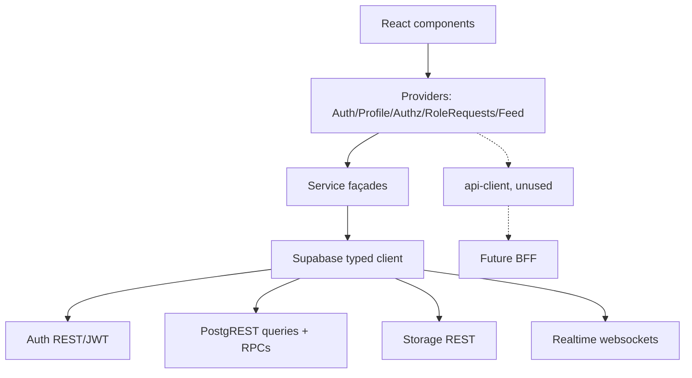
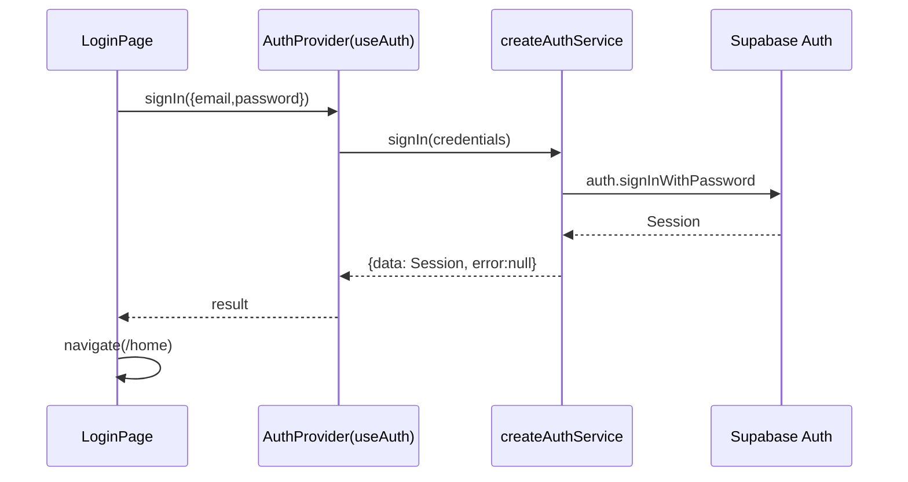
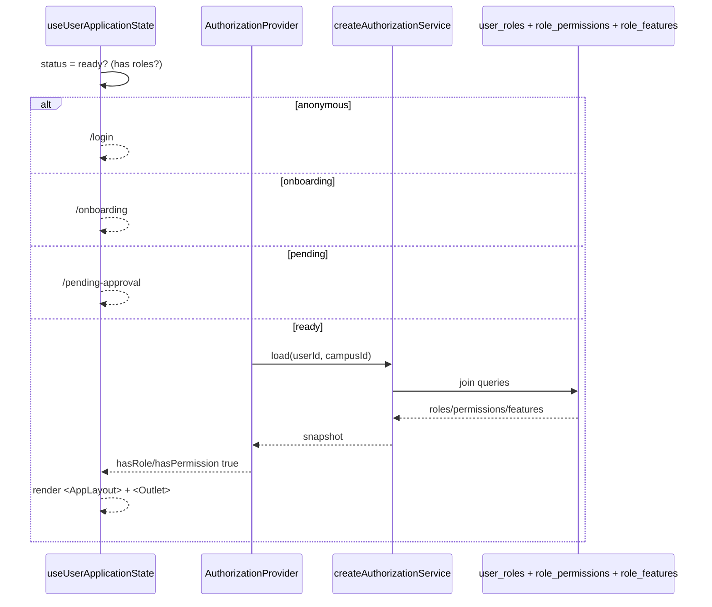
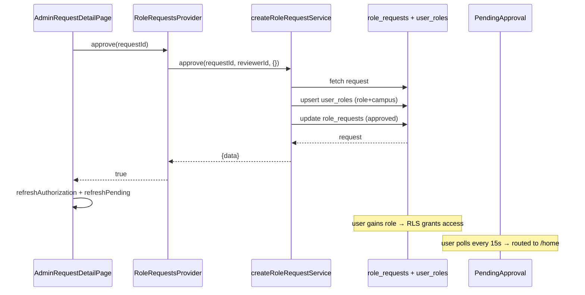

# 04 — API

> Every API surface of SUPERCAMPUS, documented.

This covers: the typed **Supabase service façades** (the de-facto "API" today), the
**Auth** service, **Storage** API, **Realtime** API, **database functions/RPCs**, the
generic **`@supercampus/api-client`** (REST — no server yet), and **external APIs**
(only referenced in legacy code).

> **Important:** There is **no REST/gRPC backend server**. The `@supercampus/api-client`
> package exists (and is wired into the provider tree) but is not exercised because no
> server runs. Client ↔ backend communication happens through the **typed Supabase
> client** (`@supercampus/supabase`).

---

## 1. API Overview

All service methods return a discriminated result:
`{ data: T | null; error: string | null }` (alias `AuthResult`, `ProfileResult`,
`FeedResult`, `RoleRequestResult`).

---

## 2. Supabase Service Façades — `@supercampus/supabase`

Source: `packages/supabase/src/*.ts`. Each `createXxxService(client)` returns an object of
methods. Providers construct services from the shared Supabase client.

### 2.1 `createAuthService` → `auth.ts`

| Method | Input | Output | Purpose |
|--------|-------|--------|---------|
| `signUp({email,password})` | `AuthCredentials` | `AuthResult<Session \| null>` | Create account (`auth.signUp`) |
| `signIn({email,password})` | `AuthCredentials` | `AuthResult<Session>` | Password sign-in |
| `signOut()` | — | `AuthResult<null>` | End session |
| `resetPassword(email)` | `string` | `AuthResult<null>` | Send reset email |
| `updatePassword(password)` | `string` | `AuthResult<User>` | Set new password |
| `getCurrentSession()` | — | `Promise<Session \| null>` | Restore session |
| `getCurrentUser()` | — | `Promise<User \| null>` | Fetch current user |

- **Error mapping** (`message()`): friendly strings for invalid credentials, already
  registered, password length, HTTP 429.
- **Authn:** Supabase JWT (browser auto-refresh).
- **Used by:** `AuthProvider`; `LoginPage`, `SignUpPage`, `ResetPasswordPage`, `OnboardingPage`.

### 2.2 `createProfileService` → `profile.ts`

| Method | Input | Output | Purpose |
|--------|-------|--------|---------|
| `bootstrap(user)` | `User` | `ProfileResult<Profile>` | Find or upsert the profile row |
| `refresh(userId)` | `string` | `ProfileResult<Profile \| null>` | Reload profile |
| `update(userId, changes)` | `string`, `ProfileUpdate` | `ProfileResult<Profile>` | Patch profile |

- **Permission:** RLS `profiles_update_own`; reads respect visibility.
- **Used by:** `ProfileProvider`, `OnboardingPage`.

### 2.3 `createAuthorizationService` → `authorization.ts`

| Method | Input | Output | Purpose |
|--------|-------|--------|---------|
| `load(userId, campusId, refresh?)` | `string`, `string\|null`, `boolean` | `{data: AuthorizationSnapshot; error: string\|null}` | Build roles/permissions/features snapshot |
| `clearCache()` | — | `void` | Clear in-memory cache |

- **How it works:** reads `user_roles` (active, non-expired, campus-scoped) → joins
  `role_permissions` → `permissions` and `role_features` → `feature_registry`
  (only `is_enabled`). Results cached by `userId:campusId`.
- **Used by:** `AuthorizationProvider`, route guards, navigation/dashboard.

### 2.4 `createFeedService` → `feed.ts`

| Method | Input | Output | Purpose |
|--------|-------|--------|---------|
| `getFeed(query)` | `FeedQuery {campusId?, cursor?, limit?, viewerId?}` | `FeedResult<FeedPage>` | Paginated feed |
| `getPost(id, viewerId?)` | `string`, `string\|null` | `FeedResult<FeedPost \| null>` | Single post |
| `createPost(input)` | `CreatePostInput` | `FeedResult<FeedPost>` | Publish post (+ media) |
| `updatePost(id, input, viewerId?)` | `string`, `UpdatePostInput` | `FeedResult<FeedPost>` | Edit post |
| `deletePost(id)` | `string` | `FeedResult<void>` | Soft-delete (`status='removed'`) |
| `likePost(postId, userId)` | `string`, `string` | `FeedResult<void>` | Upsert like |
| `unlikePost(postId, userId)` | `string`, `string` | `FeedResult<void>` | Delete like |
| `getComments(postId)` | `string` | `FeedResult<FeedComment[]>` | Thread comments |
| `createComment(input)` | `CreateCommentInput` | `FeedResult<FeedComment>` | Add comment |
| `updateComment(id, input)` | `string`, `UpdateCommentInput` | `FeedResult<FeedComment>` | Edit comment |
| `deleteComment(id)` | `string` | `FeedResult<void>` | Soft-delete comment |

- **Visibility:** `FeedVisibility = 'private' | 'campus' | 'public'`.
- **Permission:** create requires `posts.create` (RLS); edit/delete gated by RLS owner /
  `posts.moderate`.
- **Used by:** `FeedProvider` and all feed components.

### 2.5 `createRoleRequestService` → `roleRequests.ts`

| Method | Input | Output | Purpose |
|--------|-------|--------|---------|
| `create(userId, input)` | `string`, `RoleRequestInput {roleId, roleKey, campusId}` | `RoleRequestResult<RoleRequest>` | Submit request |
| `listMine(userId)` | `string` | `RoleRequestResult<RoleRequest[]>` | User's requests |
| `listPending()` | — | `RoleRequestResult<RoleRequestWithRole[]>` | Pending (admin) |
| `findRoleByKey(key)` | `string` | `RoleRequestResult<{id,key,name}\|null>` | Resolve role |
| `approve(requestId, reviewerId, assignment?)` | `string`, `string`, `{roleId?;campusId?}` | `RoleRequestResult<RoleRequest>` | Approve → upsert `user_roles` + update request |
| `reject(requestId, reviewerId, note?)` | `string`, `string`, `string?` | `RoleRequestResult<RoleRequest>` | Reject with note |

- **Permission:** approve/reject require `rbac.manage` (RLS `role_requests_admin_update`).
- **Used by:** `RoleRequestsProvider`, `OnboardingPage`, admin pages.

---

## 3. Database Functions / RPCs

Postgres functions in migrations (used **inside RLS policies**, not as a public client RPC):

| Function | Behaviour |
|----------|-----------|
| `has_permission(text, uuid default null)` | Caller has a permission (campus-scoped optional) |
| `has_feature(text, uuid default null)` | Caller has an enabled feature |
| `current_profile_id()` | `auth.uid()` |
| `current_campus_id()` | Caller's `profiles.campus_id` |
| `can_read_post(p posts)` | Post visibility (published, non-deleted, public/campus) |
| `is_valid_object_path(text)` | Path regex check |
| `set_updated_at()` | Trigger function |

There are **no `client.rpc()` calls** in the application code today.

---

## 4. Authentication APIs

Provided by Supabase Auth via the typed client (`client.auth.*`), wrapped by
`createAuthService` (§2.1): `signUp`, `signInWithPassword`, `signOut`,
`resetPasswordForEmail`, `updateUser`, `getSession`, `getUser`, `onAuthStateChange`.

- **JWT:** Supabase issues JWTs; the browser client refreshes automatically
  (`autoRefreshToken: true`).
- **Used by:** `AuthProvider` (subscription), auth pages.

---

## 5. Storage APIs

`createStorage(client)` → `client.storage` (unmodified façade).

- **Buckets:** all private, created via migration 6; object-path owner policy (first path
  segment == `auth.uid()`).
- **No upload UI yet.**

---

## 6. Realtime APIs

`createRealtime(client)` → `client.channel/removeChannel/removeAllChannels`.

- Tables in `supabase_realtime` (migration 17): `notifications`, `conversations`,
  `conversation_members`, `messages`, `message_receipts`, `event_registrations`.
- **No realtime subscription is wired yet** (feed uses state; PendingApproval uses a 15s
  poll).

---

## 7. REST API (`@supercampus/api-client`)

Source: `packages/api-client/src/client.ts`. Generic typed HTTP client for the **planned
BFF** at `VITE_BFF_URL` (default `http://localhost:5500/api/v1`).

| Method | Behavior |
|--------|----------|
| `request<T>(path, options)` | Core; attaches `Authorization: Bearer <token>` via `getAccessToken`, JSON body, envelope handling |
| `get<T>(path, options)` | GET helper |
| `post<T>(path, body?, options)` | POST helper |

- **Inputs:** `method`, `body`, `headers`, `signal`.
- **Outputs:** typed payload (or envelope `.data`); throws `AppError` on failure.
- **Auth:** `getAccessToken` from `@supercampus/core` `sessionStore`.
- **Files using it:** `AppProviders.tsx` builds `apiClient` into `PlatformContext`; **no
  calls yet**.
- **Envelope contract** (`@supercampus/contracts`): `{success:true,data}` /
  `{success:false,error:{code,message,fields}}`.

> **There are no implemented REST endpoints** — this documents the client contract only.

---

## 8. External APIs

- **Current web app:** none — talks only to Supabase.
- **Legacy (non-wired) `src/features/widgets/*`:** Open-Meteo (weather), Quotable.io
  (quote), JokeAPI (joke) — part of the `superold` migration, **not used** by `apps/web`.

---

## 9. Flow Diagrams

### Sign-in flow

### Authorize flow (route guard)

### Role request approval flow

---

## 10. Cross-references

- Auth flows: [`07_AUTHENTICATION.md`](./07_AUTHENTICATION.md)
- Database functions/policies: [`03_DATABASE.md`](./03_DATABASE.md)
- Services & providers: [`11_STATE_MANAGEMENT.md`](./11_STATE_MANAGEMENT.md)

