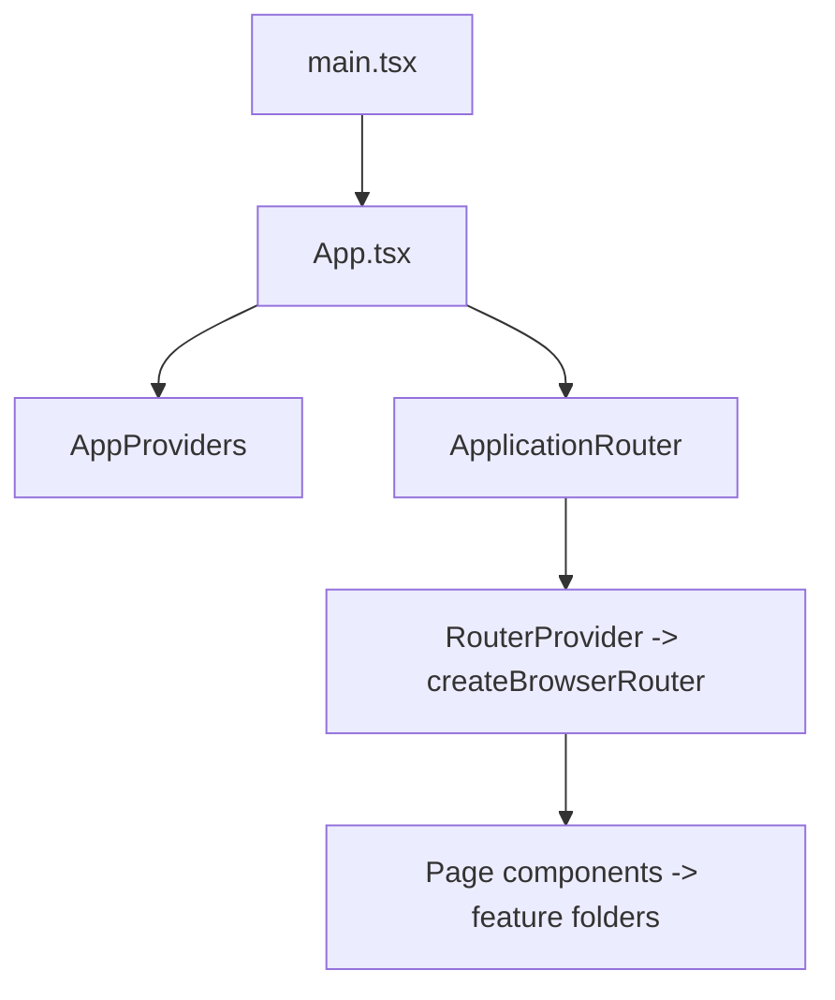

# 05 — Frontend

> Frontend architecture of **apps/web** (React 19 PWA).

Source root: `apps/web/`. All entry points (except the legacy `src/` folder) live here.

---

## 1. React Architecture

- **Entry:** `src/main.tsx` → mounts `<App/>` (React StrictMode).
- **`App`** (`src/app/App.tsx`): wraps `AppProviders`, then `ApplicationRouter` which
  renders the router once providers are ready (loading / error screen otherwise).
- **Function components + hooks only** (no class components; no global state library —
  React context + `@tanstack/react-query`).
- **TypeScript strict**; files use `.tsx` for JSX, `.ts` for non-JSX (contexts, builders,
  services).



---

## 2. Pages

Location: `apps/web/src/app/pages/` and per-feature folders.

| Page | File | Route | Notes |
|------|------|-------|-------|
| LoginPage | `pages/LoginPage.tsx` | `/login` | Email/password |
| SignUpPage | `pages/LoginPage.tsx` | `/signup` | Same file, separate export |
| ResetPasswordPage | `pages/LoginPage.tsx` | `/reset-password` | Same file |
| OnboardingPage | `pages/OnboardingPage.tsx` | `/onboarding` | Multi-step wizard |
| PendingApprovalPage | `pages/PendingApprovalPage.tsx` | `/pending-approval` | 15s poll |
| AdminRequestsPage | `pages/AdminRequestsPage.tsx` | `/admin/requests` | Pending list |
| AdminRequestDetailPage | `pages/AdminRequestDetailPage.tsx` | `/admin/requests/:requestId` | Approve/reject |
| NotFoundPage | `pages/NotFoundPage.tsx` | `*` | 404 |
| PlaceholderPage | `pages/PlaceholderPage.tsx` | future features | Empty-state stub |
| ApplicationState | `pages/ApplicationState.tsx` | — | Loading/error screens |
| FeedPage | `feed/FeedPage.tsx` | `/home` | Feed feature |
| DashboardPage | `dashboard/DashboardPage.tsx` | (unregistered) | Dashboard cards |

---

## 3. Layouts

### `AppLayout` (`layout/AppLayout.tsx`)
The **active** shell for protected routes. Renders a `Header` (logo, search/notifications/
theme/sign-out buttons) and a `Sidebar` (desktop sidebar + mobile bottom-nav + "More"
drawer). Uses `useSidebar()` (from `NavigationProvider`) for items and `useTheme()`.

### `MainLayout` (`layout/MainLayout.tsx`) — legacy
A simpler top-bar + bottom-nav shell with `BOTTOM_NAV_ITEMS` from `@supercampus/core`.
**Not used** by the current router (kept as reference).

---

## 4. Components

### Shared UI primitives (`@supercampus/shared`)
- `Button` (`ui/Button.tsx`) — variants primary/secondary/ghost/outline; sizes sm/md/lg.
- `Input` (`ui/Input.tsx`) — labelled input with optional error.
- `Card` (`ui/Card.tsx`) — padding sm/md/lg container.
- `Spinner` (`ui/Spinner.tsx`) — sm/md/lg loader with optional label.
- `EmptyState` (`ui/EmptyState.tsx`) — icon + title + description + optional action.
- `cn` util (`utils/cn.ts`) — join class names.

### Feed feature components (`app/feed/`)
`FeedPage`, `FeedProvider`, `FeedContext`, `FeedList`, `FeedCard`, `CreatePostCard`,
`PostComposer`, `CommentThread`, `CommentComposer`, `EmptyFeed`, `ErrorState`,
`LoadingSkeleton`, `time.ts` (relative timestamps).

### Dashboard components (`app/dashboard/`)
`DashboardPage`, `DashboardProvider`, `dashboardBuilder` (+ `DashboardCard`,
`DashboardSection`, `DashboardLayout`).

### Navigation components (`app/navigation/`)
`NavigationProvider`, `navigationBuilder` (builds nav items from enabled features).

---

## 5. Providers

See [`11_STATE_MANAGEMENT.md`](./11_STATE_MANAGEMENT.md) and
[`02_ARCHITECTURE.md`](./02_ARCHITECTURE.md). In order:

`QueryClientProvider` → `SupabaseProvider` → `AuthProvider` → `ProfileProvider` →
`AuthorizationProvider` → `RoleRequestsProvider` → `ApplicationProvider` →
`NavigationProvider` → `DashboardProvider` → `PlatformProvider` → `ThemeProvider`
→ children.

---

## 6. Contexts

| Context | Type | Defined in |
|---------|------|-----------|
| Server cache | — | `AppProviders.tsx` (`QueryClientProvider`) |
| Supabase client | `SupabaseClient<Database>` | `packages/supabase/src/provider.tsx` |
| Auth | `AuthContextValue` | `packages/supabase/src/authProvider.tsx` |
| Profile | `ProfileContextValue` | `packages/supabase/src/profileProvider.tsx` |
| Authorization | `AuthorizationContextValue` | `packages/supabase/src/authorizationProvider.tsx` |
| Role requests | `RoleRequestsContextValue` | `packages/supabase/src/roleRequestsProvider.tsx` |
| Application | `ApplicationContextValue` | `app/providers/ApplicationProvider.tsx` |
| Navigation | `{sidebar, topNavigation, quickActions}` | `app/navigation/NavigationProvider.tsx` |
| Dashboard | `{sections}` | `app/dashboard/DashboardProvider.tsx` |
| Platform | `{env, eventBus, apiClient, supabase}` | `app/providers/PlatformContext.tsx` |
| Theme | `{theme, setTheme, toggleTheme}` | `packages/shared/src/theme/ThemeProvider.tsx` |
| Feed | `FeedContextValue` | `app/feed/FeedContext.ts` |

---

## 7. Hooks

- **Domain hooks** (from providers): `useAuth`, `useProfile`, `useAuthorization`,
  `useRoleRequests`, `useSupabase`, `useSidebar`/`useNavigation`/`useQuickActions`,
  `useDashboard`, `useFeed`, `useTheme`, `useApplication`, `usePlatform`.
- **Derived helper hooks:** `useRoles`, `usePermissions`, `useFeatures`,
  `useHasPermission`, `useHasFeature`, `useCurrentCampus` (from `AuthorizationProvider`).
- **Local logic hook:** `useUserApplicationState` (`app/providers/useUserApplicationState.ts`)
  derives the app stage (`loading | anonymous | onboarding | pending | ready`).

---

## 8. Forms

- **Login / Signup / ResetPassword:** native `<form>` + local `useState`; validation is a
  small regex + length checks; errors map to friendly strings. Submit calls the auth
  service and redirects.
- **Onboarding:** multi-step wizard (`welcome → profile → academic → role → verification
  → review`) with local state; pushes `updateProfile` then `createRequest`.
- **Feed composer / comments:** controlled textareas/inputs with char limits and
  Ctrl+Enter / Enter submit shortcuts.

---

## 9. Navigation

- **Router:** `createBrowserRouter` (`app/routes/index.tsx`), lazy-loaded pages via
  `React.lazy` + `<Suspense>` fallback (`Spinner`).
- **Sidebar items:** derived from `AuthorizationProvider.features` (those with a `route`),
  sorted by `sortOrder`, via `navigationBuilder`.
- **Bottom nav "More" drawer** shows items beyond the first five.
- **Protected routes** wrap children in `<AppLayout><Outlet/></AppLayout>`.

---

## 10. Protected Routes

Defined in `app/routes/guards.tsx`:

| Guard | Behavior |
|-------|----------|
| `ProtectedLayout` | Loading → spinner; anonymous → `/login`; onboarding → `/onboarding`; pending → `/pending-approval`; ready → `AppLayout` + children |
| `PublicRoute` | Anonymous → children; otherwise redirect to status route |
| `FeatureRoute` / `PermissionRoute` | Checks `metadata.feature` / `metadata.permission`; redirects `/home` if missing |
| `RootRedirect` | `/` → status-appropriate route |

> Note: `FeatureRoute`/`PermissionRoute` are exported but **not currently attached** to any
> route; route-level feature gating is not yet wired. `AppLayout` items are feature driven,
> though.

---

## 11. Feature Flags

- **Runtime feature gating** comes from the **database** (`feature_registry` + `role_features`)
  surfaced by `AuthorizationProvider` → `useFeatures()` / `hasFeature()`.
- `@supercampus/core` `RouteMetadata` declares optional `feature` / `permission` for future
  declarative route guards.
- `feature_flags` table exists in the DB (migration 16) but is **not consumed by the client**.

---

## 12. State Management

- **Server state:** `QueryClient` (created once in `AppProviders`); `staleTime: 30_000`,
  `retry: 1`, `refetchOnWindowFocus: false`. Note: most app data is NOT via react-query
  today — providers use their own `useState` + effects.
- **Client state:** React context (see §5/§6). Feed state is local to `FeedProvider`
  (posts, cursor, comment maps, pending sets) with optimistic updates.
- **Derived state:** navigation/dashboard derived from authorization features;
  `useUserApplicationState` derived from auth/profile/authorization/role-requests.

---

## 13. Folder Organization (feature-ish)

```text
apps/web/src/
├── app/
│   ├── App.tsx
│   ├── providers/      # AppProviders, ApplicationProvider, PlatformContext, useUserApplicationState
│   ├── routes/         # router + guards
│   ├── layout/         # AppLayout, MainLayout
│   ├── navigation/     # NavigationProvider + builder
│   ├── dashboard/      # DashboardProvider + page + builder
│   ├── pages/          # auth + onboarding + admin + misc pages
│   └── feed/           # Feed feature
├── styles/global.css
├── vite-env.d.ts
└── main.tsx
```

---

## 14. Cross-references

- Routing table: [`10_ROUTES.md`](./10_ROUTES.md)
- State & providers: [`11_STATE_MANAGEMENT.md`](./11_STATE_MANAGEMENT.md)
- Services/APIs: [`04_API.md`](./04_API.md)
- Feature/folder guide: [`12_FOLDER_GUIDE.md`](./12_FOLDER_GUIDE.md)


