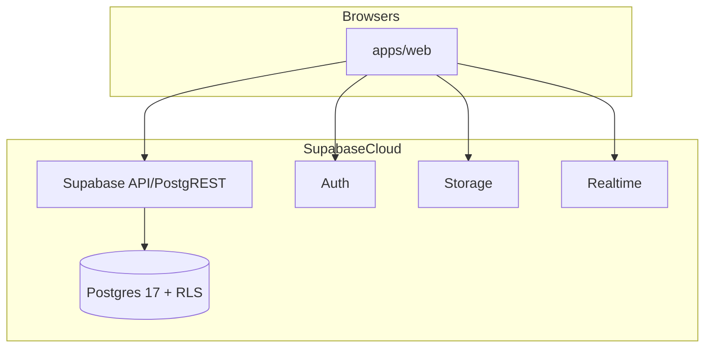
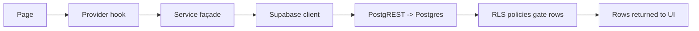

# 06 — Backend

> Backend documentation for SUPERCAMPUS.

**Honest framing:** there is currently **no application server** (no HTTP/Express/Fastify
service). The "backend" is **Supabase**: Postgres + RLS + Auth + Storage + Realtime, plus
the **service façade layer** in `@supercampus/supabase` that encapsulates all database
access. This document maps the requested backend concepts onto what actually exists.

---

## 1. Server Architecture

- **No dedicated backend process.** `services/` is declared in `pnpm-workspace.yaml` but
  **no folder exists**. `@supercampus/api-client` targets a future BFF
  (`VITE_BFF_URL`, default `http://localhost:5500/api/v1`) — nothing listens there.



Where a "server" would usually provide services/controllers/middleware, we instead rely on:

1. **PostgREST** (the Supabase API) for data queries over REST.
2. **RLS policies** as the authorization middleware (the real enforcement point).
3. **Postgres functions/triggers** for cross-cutting logic (`set_updated_at`,
   `create_profile_for_user`, `has_permission`, `can_read_post`, …).

---

## 2. Services

The only service layer is client-side façade **services** in `@supercampus/supabase`:

| Service | File | Responsibility |
|---------|------|----------------|
| `createAuthService` | `auth.ts` | Auth operations wrapping `client.auth` |
| `createProfileService` | `profile.ts` | Profile CRUD / bootstrap |
| `createAuthorizationService` | `authorization.ts` | Build roles/permissions/features snapshot |
| `createFeedService` | `feed.ts` | Feed posts/comments/likes (queries + normalization) |
| `createRoleRequestService` | `roleRequests.ts` | Role request create/approve/reject |
| `createStorage` | `storage.ts` | `client.storage` façade |
| `createRealtime` | `realtime.ts` | `client.channel` façade |
| `createDatabase` | `database.ts` | `client.from/rpc/schema` façade |
| `createServerSupabaseClient` | `server.ts` | **Server-only** service-role client for future jobs |

These services own **business-facing method signatures** and **error mapping**; they do not
run on a server — they run in the browser against Supabase.

---

## 3. Repositories

- **There are no repository classes.** Queries are written inline in the service façades
  using the typed Supabase client.
- The application talks to tables by name via `client.from('<table>')`.
- Reusable query logic lives inside `authorization.ts` / `feed.ts` / `roleRequests.ts`.

---

## 4. Controllers

- **No controllers** (no HTTP server).
- The closest equivalent is **route handlers** in React pages (e.g.
  `AdminRequestDetailPage` calling `approve`/`reject`) and the **RLS policies** that gate
  every DB operation.

---

## 5. Middleware

| Concept | Equivalent in this project |
|---------|----------------------------|
| Auth middleware | Supabase JWT verification on every request; `auth.uid()` in RLS |
| Authorization middleware | RLS policies + `has_permission`/`has_feature` functions |
| Validation | Client-side checks in services + Postgres `check` constraints |
| Logging | `@supercampus/core` `logger.ts` (client console logger); `audit_logs` table (schema only) |
| Error handling | Service `{data, error}` results; `feed.ts` logs Supabase errors to console |

RLS is the effective middleware and is **non-optional** for every domain table.

---

## 6. Validation

- **Client/service level:** services trim input (`feed.ts`, `roleRequests.ts`) and return
  friendly errors (e.g. empty post/comment).
- **Client env level:** Zod schemas (`supabase/src/env.ts`, `core/src/config/env.ts`).
- **Database level:** `check` constraints on many columns (status enums, price ≥ 0, handle
  format, date ordering, JSONB object type, etc.) — see [`03_DATABASE.md`](./03_DATABASE.md).

---

## 7. Authentication

- Handled by **Supabase Auth** (JWT). The browser client manages session persistence and
  refresh (`autoRefreshToken`, `persistSession`, `detectSessionInUrl`).
- `AuthProvider` reacts to `onAuthStateChange`; the current `user`/`session` feed RLS via
  `auth.uid()`.
- Full flow: [`07_AUTHENTICATION.md`](./07_AUTHENTICATION.md).

---

## 8. Permissions

- **RBAC tables:** `roles`, `permissions`, `role_permissions`, `user_roles`,
  `feature_registry`, `role_features`.
- **DB functions:** `has_permission(key, campus?)`, `has_feature(key, campus?)` — used by
  RLS policies.
- **Client mirror:** `AuthorizationProvider` snapshot + `hasPermission`/`hasFeature`/etc.
- **Effective rule:** the database enforces; the client only reflects for UX.

Example enforcement for creating a post:
```sql
-- posts_insert
author_id = auth.uid()
AND has_permission('posts.create', campus_id)
```

---

## 9. Business Logic

Business rules live in one of three places:

1. **Database triggers/functions** (authoritative):
   - `create_profile_for_user()` — auto-create profile + settings on signup.
   - `set_updated_at()` — timestamp maintenance.
   - `can_read_post()` — feed visibility.
2. **Service façades** (`packages/supabase/src/*.ts`):
   - Feed optimistic workflows, pagination, soft delete.
   - Role request approval (upsert `user_roles` + mark approved).
   - Default profile/handle derivation.
3. **Client pages/providers**:
   - Onboarding step flow, pending-approval polling, app-stage state machine.

---

## 10. Data Access Layer Summary



Because there is no server, **"backend" permissions and validation are exercised entirely
server-side by Postgres** — good for security, but all aggregation logic currently runs in
the browser.

---

## 11. Security Notes

- Never put the `service_role` key into browser env vars. `@supercampus/supabase/server`
  (`createServerSupabaseClient`) is the only place that reads `SUPABASE_URL` +
  `SUPABASE_SERVICE_ROLE_KEY`, and it must never be imported by `apps/web`.
- RLS is the backstop; client-side `hasPermission` is UX only.
- Buckets are private; object reads are intentionally ungranted until parent-entity access
  functions are added.

---

## 12. Cross-references

- APIs: [`04_API.md`](./04_API.md)
- Database: [`03_DATABASE.md`](./03_DATABASE.md)
- Authentication: [`07_AUTHENTICATION.md`](./07_AUTHENTICATION.md)
- Planned BFF: [`14_TODO.md`](./14_TODO.md)
