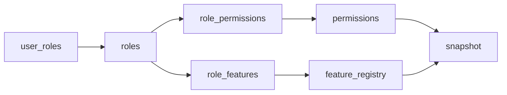

# 07 — Authentication

> Authentication & authorization flows in SUPERCAMPUS.

Auth is **Supabase Auth** (email/password, JWT). The client wraps it in `AuthProvider`
(`packages/supabase/src/authProvider.tsx`) and `createAuthService`
(`packages/supabase/src/auth.ts`). Profile bootstrap & role data are layered on top.

---

## 1. Flow Overview

```mermaid
graph TD
    A[Anonymous] -->|/login| LOGIN[Sign in]
    A -->|/signup| SIGNUP[Create account]
    A -->|/reset-password| RESET[Reset password]
    LOGIN --> SESSION[AuthProvider session]
    SIGNUP --> SESSION
    SESSION --> PROFILE[ProfileProvider bootstrap]
    PROFILE --> AUTHZ[AuthorizationProvider roles/permissions/features]
    AUTHZ --> STATE[useUserApplicationState]
    STATE -->|ready| HOME[/home]
    STATE -->|onboarding| ONB[/onboarding]
    STATE -->|pending| PA[/pending-approval]
```

---

## 2. Signup

1. `SignUpPage` validates email + password (≥6 chars) + confirm match.
2. Calls `useAuth().signUp({email, password})` → `createAuthService.signUp` →
   `client.auth.signUp`.
3. If Supabase returns a **session** (email confirmation disabled), the user is
   authenticated and navigated to `/home`.
4. Otherwise the UI shows "Check your email to confirm your account, then sign in."
5. A DB trigger `create_profile_for_user()` auto-creates `profiles` + `user_settings`.

**Used by:** `SignUpPage` (`apps/web/src/app/pages/LoginPage.tsx`).

---

## 3. Login

1. `LoginPage` validates email format + password presence.
2. `useAuth().signIn({email, password})` → `createAuthService.signIn` →
   `client.auth.signInWithPassword`.
3. On success, `AuthProvider` receives the session via `onAuthStateChange` and the page
   calls `navigate('/home')`.
4. On failure, `message()` maps errors to friendly strings (invalid credentials →
   "Incorrect email or password.").

**Used by:** `LoginPage`.

---

## 4. Logout

- `AppLayout` header button calls `useAuth().signOut()` → `createAuthService.signOut` →
  `client.auth.signOut`.
- `onAuthStateChange` fires with no session → `authenticated === false`, providers reset
  their state, and the router redirects anonymous users to `/login`.

**Used by:** `AppLayout`, `OnboardingPage` (logout button).

---

## 5. Password Reset

1. `ResetPasswordPage` collects email → `useAuth().resetPassword(email)` →
   `client.auth.resetPasswordForEmail`.
2. UI shows "If an account exists for this email, a reset link has been sent."
3. `updatePassword(password)` exists in the service (wraps `auth.updateUser({password})`)
   but is **not yet wired to UI** — the email-link final step page isn't built.

---

## 6. Session Refresh

- The Supabase browser client uses `autoRefreshToken: true`, `persistSession: true`,
  `detectSessionInUrl: true` (`packages/supabase/src/client.ts`).
- Supabase transparently refreshes short-lived JWTs; `AuthProvider` re-renders on session
  change via `onAuthStateChange`.

---

## 7. JWT

- Supabase issues and validates JWTs. RLS reads `auth.uid()` from the JWT.
- Client never deals with raw tokens except via `getAccessToken` (`@supercampus/core`
  `sessionStore.ts`) which is **legacy infrastructure** wired for the future BFF; the live
  auth path uses Supabase's session directly.
- `@supercampus/core`'s `AuthProvider` port / `registerAuthProvider` /
  `createStubAuthProvider` are **foundation stubs** not used by the running app — the real
  auth is `@supercampus/supabase`.

---

## 8. Profile Bootstrap

- `ProfileProvider` calls `createProfileService.bootstrap(user)` on auth:
  1. Find the profile row by `id`.
  2. If missing, upsert a default profile (display name from `user_metadata.display_name`
     or email local-part; handle `user-<uuid-no-dashes>`).
- `isFirstLogin` is `true` when `profile.campus_id === null` (indicates onboarding needed).
- During onboarding the user's profile is enriched with campus/department/program/names.

---

## 9. Authorization

See also [`02_ARCHITECTURE.md`](./02_ARCHITECTURE.md) §7.

- `AuthorizationProvider` builds a snapshot from:
  - `user_roles` (active, non-expired, campus-scoped) → roles.
  - `role_permissions` → permission keys.
  - `role_features` → enabled features.
- Exposes `hasRole`, `hasPermission`, `hasAnyPermission`, `hasAllPermissions`,
  `hasFeature`, `getCurrentRoles/Permissions/Features`, `refreshAuthorization`.



---

## 10. Role System

Roles (seed `roles.sql`): `super_admin`, `campus_admin`, `faculty`, `student`, `alumni`,
`vendor`, `hostel_staff`, `moderator`.

- Users don't pick an arbitrary role — they **request** one during onboarding; an admin
  approves it (writes a `user_roles` row).
- `user_roles` rows are campus-scoped and may expire (`expires_at`).
- `super_admin` gets every permission and every feature (seeded).

---

## 11. Permission System

- Permissions are `module.key` strings (e.g. `posts.create`, `rbac.manage`).
- They are granted to roles via `role_permissions` and enforced by RLS via
  `has_permission(...)`.
- The client mirrors the current user's effective permission set for UX gating
  (`CreatePostCard` uses `hasPermission('posts.create')`).

---

## 12. Application State (app stage machine)

`useUserApplicationState` (`apps/web/src/app/providers/useUserApplicationState.ts`):

| Stage | Condition |
|-------|-----------|
| `loading` | Any provider loading |
| `anonymous` | Not authenticated |
| `ready` | Authenticated and has ≥1 role |
| `pending` | Authenticated, no role, has a pending role request |
| `onboarding` | Authenticated, no role, no request |

Guards route each stage accordingly (see [`10_ROUTES.md`](./10_ROUTES.md)).

---

## 13. Protected Routes

- `ProtectedLayout`: only renders children when stage is `ready`.
- `PublicRoute`: only renders children when `anonymous`.
- `RootRedirect`: redirects `/`.
- See [`05_FRONTEND.md`](./05_FRONTEND.md) §10.

---

## 14. End-to-End: Signup → Ready

```mermaid
sequenceDiagram
    participant U as User
    participant S as SignUpPage
    participant A as AuthProvider
    participant P as ProfileProvider
    participant AZ as AuthorizationProvider
    participant O as OnboardingPage
    participant R as RoleRequestsProvider
    participant DB as Supabase
    U->>S: create account
    S->>A: signUp
    A->>DB: auth.signUp
    DB-->>A: user + (maybe session)
    A-->>S: result; S -> /home
    P->>DB: bootstrap profile (trigger auto-created row)
    AZ->>DB: load roles (none yet)
    Note over O: state = onboarding
    U->>O: fill onboarding, submit
    O->>P: updateProfile(campus/dept/program)
    O->>R: createRequest(role)
    R->>DB: insert role_requests (pending)
    Note over PA: state = pending
    Admin->>DB: approve → upsert user_roles
    R->>DB: poll (15s) → sees approved
    AZ->>DB: refresh → has role
    Note over HOME: state = ready → /home
```

---

## 15. Cross-references

- Architecture: [`02_ARCHITECTURE.md`](./02_ARCHITECTURE.md)
- Routes: [`10_ROUTES.md`](./10_ROUTES.md)
- RBAC tables: [`03_DATABASE.md`](./03_DATABASE.md)
- Providers/state: [`11_STATE_MANAGEMENT.md`](./11_STATE_MANAGEMENT.md)
