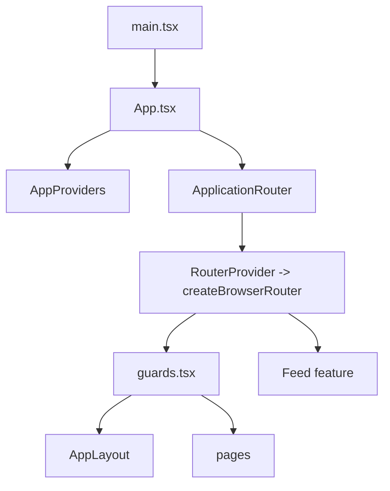
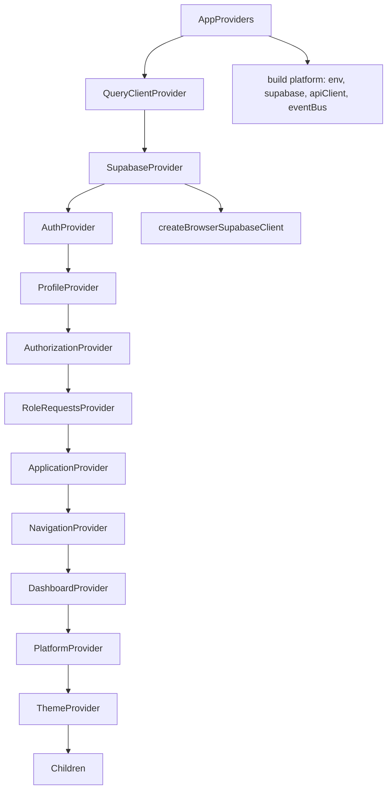
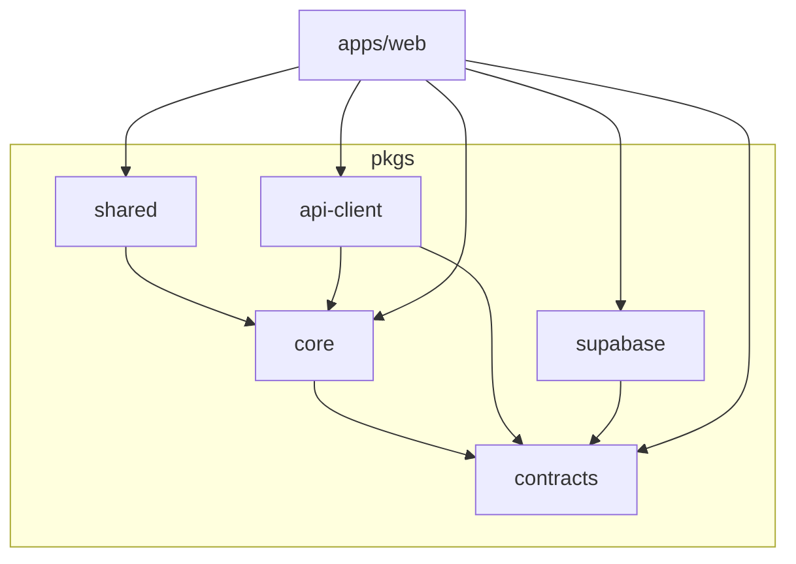
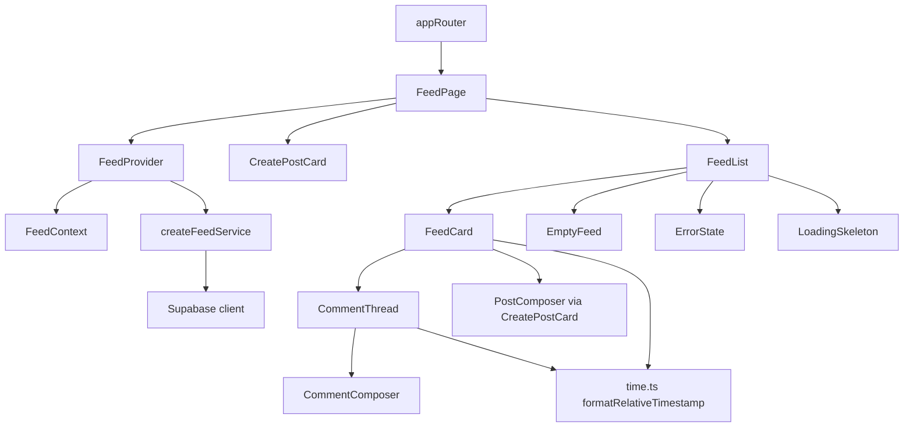
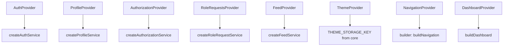

# 09 — Component Map

> Dependency graph of pages, components, hooks, providers, utilities, and services.

This is a source-level map of `apps/web` + the `@supercampus/*` packages it consumes.

---

## 1. Top-Level Graph

---

## 2. Provider Graph (apps/web + supabase package)

---

## 3. Package Dependency (source graph)

---

## 4. Feed Feature Dependency Graph

Exports/hooks: `FeedContext` exports `useFeed`; `FeedCard` is `memo`ized.

---

## 5. Pages → Hooks/Services Map

| Page | Hooks / services used |
|------|-----------------------|
| `LoginPage` / `SignUpPage` / `ResetPasswordPage` | `useAuth` (signIn/signUp/resetPassword) |
| `OnboardingPage` | `useUserApplicationState`, `useSupabase`, `useProfile`, `useRoleRequests`, `useAuth` |
| `PendingApprovalPage` | `useUserApplicationState`, `useAuthorization`, `useProfile`, `useRoleRequests` |
| `AdminRequestsPage` | `useUserApplicationState`, `useRoleRequests` |
| `AdminRequestDetailPage` | `useUserApplicationState`, `useRoleRequests`, `useAuthorization` |
| `NotFoundPage` | `Link`/`ROUTES` |
| `PlaceholderPage` | `EmptyState` |
| `ApplicationState` | `useApplication` |
| `FeedPage` | `useFeed` (via children) |
| `DashboardPage` | `useProfile`, `useRoles`, `useDashboard` |

---

## 6. Providers & Their Services

---

## 7. Utilities & Shared Modules

| Module | Used by |
|--------|---------|
| `@supercampus/shared`: `Button`, `Input`, `Card`, `Spinner`, `EmptyState`, `cn`, `ThemeProvider`/`useTheme` | All pages/components |
| `@supercampus/core`: `ROUTES`, `BOTTOM_NAV_ITEMS`, `createPlatformEventBus`, `loadClientEnv`, `getAccessToken`, `THEME_STORAGE_KEY`, `AppError`, `RouteMetadata` | routes, providers, theme, api-client |
| `@supercampus/contracts`: `ErrorCode`, `ApiEnvelope`, `PlatformEventMap`, permissions | core, api-client |
| `feed/time.ts` | FeedCard, CommentThread |

---

## 8. Service → Table Map

| Service | Tables |
|---------|--------|
| `createAuthService` | (Supabase `auth.*`) |
| `createProfileService` | `profiles` |
| `createAuthorizationService` | `user_roles`, `role_permissions`, `role_features`, `feature_registry` |
| `createFeedService` | `posts`, `post_media`, `post_likes`, `post_comments`, `profiles` |
| `createRoleRequestService` | `role_requests`, `user_roles`, `roles`, `campuses` |
| `createStorage` | Storage buckets (private) |
| `createRealtime` | Realtime channels |
