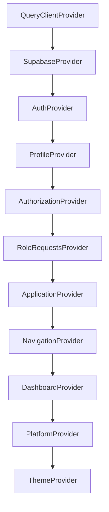

# 11 — State Management

> How state is managed in SUPERCAMPUS: providers, contexts, globals, derived state,
> caching, refresh, and polling.

There is **no global store library** (Redux/Zustand are not used at runtime). State is
**React Context** (`createContext` + providers) plus `@tanstack/react-query` for the query
cache, and local component state for forms/UI. (`@supercampus/core` has a Zustand
`sessionStore`, but it is **legacy infrastructure** not used by the running app.)

---

## 1. Provider Tree (state ownership)

Each provider owns a slice of mutable state and exposes memoized actions via context.

---

## 2. All Providers

| Provider | Context value shape | Owns |
|----------|---------------------|------|
| `QueryClientProvider` | react-query cache | server-fetch cache (mostly unused today) |
| `SupabaseProvider` | `SupabaseClient<Database>` | the shared client |
| `AuthProvider` | `{user, session, loading, authenticated} + auth service` | session/user |
| `ProfileProvider` | `{profile, loading, error, exists, isFirstLogin, refreshProfile, updateProfile}` | profile row |
| `AuthorizationProvider` | `{roles, permissions, features, campusId, loading, error, ready, refreshAuthorization, hasRole, hasPermission, ...}` | authorization snapshot |
| `RoleRequestsProvider` | `{myRequests, current, pendingRequests, loading, error, canManage, createRequest, approve, reject, refresh, refreshPending}` | role requests |
| `ApplicationProvider` | `{loading, ready, error, retryInitialization}` | aggregate bootstrap state |
| `NavigationProvider` | `{sidebar, topNavigation, quickActions}` | derived nav items |
| `DashboardProvider` | `{sections}` | dashboard sections |
| `PlatformProvider` | `{env, eventBus, apiClient, supabase}` | platform objects |
| `ThemeProvider` | `{theme, setTheme, toggleTheme}` | theme (localStorage `sc_theme`) |
| `FeedProvider` | `FeedContextValue` | feed posts/comments/likes state |

---

## 3. All Contexts

`SupabaseContext`, `AuthContext`, `ProfileContext`, `AuthorizationContext`,
`RoleRequestsContext`, `ApplicationContext`, `NavigationContext`, `DashboardContext`,
`PlatformContext`, `ThemeContext`, `FeedContext`. Each has a hook (`useX()`) that throws
if used outside its provider.

---

## 4. Global State

- **Platform objects** (`env`, `eventBus`, `apiClient`, `supabase`) live in
  `PlatformContext` — constructed once in `AppProviders`.
- **Event bus** (`createPlatformEventBus`) is a typed pub/sub used for cross-cutting
  events (`auth:`, `theme:changed`, etc.). Currently only `theme:changed` is emitted
  (`AppProviders` → `ThemeProvider.onThemeChange`).
- **Query cache** (`QueryClient`) is a single app-wide instance.

---

## 5. Derived State

| Derived value | From | Produced by |
|---------------|------|-------------|
| `navigation` (sidebar/top/quick) | `AuthorizationProvider.features` | `NavigationProvider` (`buildNavigation`) |
| `dashboard.sections` | features + quick actions | `DashboardProvider` (`buildDashboard`) |
| `useUserApplicationState().status` | auth + profile + authorization + roleRequests | `useUserApplicationState` |
| `canManage` (role requests) | `hasPermission('rbac.manage')` | `RoleRequestsProvider` |
| Feed `commentStates`, `pendingLike*`, `pendingComment*` | local mutation state | `FeedProvider` |

---

## 6. Caching

- **react-query:** `staleTime: 30_000`, `retry: 1`, `refetchOnWindowFocus: false`
  (configured in `AppProviders.tsx`). Not heavily used yet.
- **Authorization service:** in-memory per-`userId:campusId` promise cache
  (`authorization.ts`), cleared on `clearCache()` or when `refresh` is forced.
- **Theme:** `localStorage` key `sc_theme`.

---

## 7. Refresh Logic

| Action | What it re-loads |
|--------|------------------|
| `ProfileProvider.refreshProfile` | profile row |
| `AuthorizationProvider.refreshAuthorization` | roles/permissions/features (forces cache refresh) |
| `RoleRequestsProvider.refresh` / `refreshPending` | own requests / pending (admin) |
| `FeedProvider.refresh` / `loadMore` | feed pages |
| `ApplicationProvider.retryInitialization` | profile + authorization + role requests |
| `PendingApprovalPage` interval (15s) | authorization + profile + role requests |

---

## 8. Polling

- **PendingApprovalPage** polls every **15s** (`window.setInterval` in a `useEffect`,
  cleared on unmount) to re-check authz/profile/request so an approved user is routed to
  `/home` promptly.
- **No other polling** exists; realtime is not yet wired.

---

## 9. Optimistic Updates (Feed)

`FeedProvider` applies optimistic local mutations and rolls them back on error:

- **createPost / updatePost / deletePost** — inline optimistic text changes.
- **toggleLike** — optimistic `likedByMe` + count, with `pendingLikePostIds` guard.
- **createComment / updateComment / deleteComment** — optimistic comments with
  `pendingCommentIds` guard; comment counts adjusted and rolled back on failure.
- Uses `crypto.randomUUID()` for temporary ids.

---

## 10. Caching vs. Direct Fetch Note

Most domain reads go **directly to Supabase** through providers (not through the react-query
cache). The `QueryClient` is present for future server-cached data and is available app-wide.

---

## 11. Cross-references

- Provider architecture: [`02_ARCHITECTURE.md`](./02_ARCHITECTURE.md) §11
- Frontend hooks/contexts: [`05_FRONTEND.md`](./05_FRONTEND.md) §5–7
- Services: [`04_API.md`](./04_API.md)
